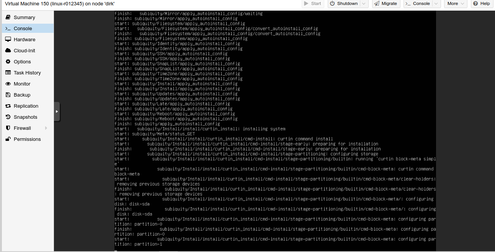

# Introductie

Welkom in de cursus Linux Server. Deze cursus behoord tot de graduaatsopleiding netwerkbeheer van Thomas More.
Deze cursus bouwt verder op "Linux Essentials" van het eerste semester. We gaan nu aan de slag met jullie basis Linux kennis en deze in de praktijk omzetten. We bekijken de volgende items:

- Security
  - SSH (Secure Shell)
  - UFW Firewall
- LAMP/LEMP-stack voor het draaien van dynamische websites op een Linux Server
- Types van databases
- Het gebruik van een webserver

  - MariaDB als database in onze LAMP-Stack

- Loadtesting
- Services met systemd
- Troubleshooting van servers
- DNS
- Linux containers met Docker

Voor deze cursus maken we gebruik van Ubuntu 20.04 LTS. (Op het moment van schrijven is 22.04 in beta, we volgen de release op en hopen tegen volgend academiejaar de cursus aan te passen.)

## Cursus

De cursus bestaat uit een online cursus op deze website. Hier vind je alle leerstof van dit vak terug in de vorm van cursusteksten, commando's en voorbeeldconfiguratie.
Aanvullende mededelingen alsook taken en deadlines zullen altijd op Canvas gepubliceerd worden, deze website bevat enkel theorie.

Onder sommige hoofdstukken kan je ook slides vinden die in de les gebruikt waren, deze zijn te bekijken in je webbrowser, je kan best navigeren door deze door de pijltjestoetsen naar rechts en onder te gebruiken.

::: warning note
Deze cursus is nog vollop in aanbouw, hoofdstukken zullen in de loop van dit semester uitgebeid en toegevoegd worden.

In spirit van open source, deze cursus is beschikbaar op GitHub! Bijdragen altijd welkom op [https://github.com/meyskens/linux-server-graduaten](https://github.com/meyskens/linux-server-graduaten)
:::

### Lessen

Er zijn een 12-tal contactmomenten voorzien, organisatie van deze is afhankelijk van COVID-19. Alle wijzwgingen zullen in Canvas en/of het lessenrooster worden gecommuniceerd.
In deze lessen gaan we starten met de nodige theorie gevolgd door een begeleid deel hands-on. Alle instructies kan je nalezen in deze cursus zodat je op je eigen tempo kan volgen indien gewenst.

### Individueel project

De laatste 3 (kan veranderen) contactmomenten voorzien we tijd voor het werken aan je individueel project en vragen aan de docent hierover stellen. Meer hierover zie bij evaluatie.

## Evaluatie

De evaluatie van dit vak loopt in 2 delen:

### Permanente evaluatie (PE): 60% indivudueel project

Een integratieproject dat individueel uitgevoerd zal worden. Het resultaat verwerk je in een uitgebreid document en hier wordt je op beoordeeld.
In de loop van het semester comminuceren we de exacte opdracht.

- geziene en niet-geziene leerstof verwerven en toepassen
- (gedeeltelijk) gebaseerd op eerdere opdrachten en ervaring
- bewijzen van praktische kennis op een VM in de cloud
- losstaande componenten laten samenwerken tot één oplossing
- met begeleiding (coaching) langs onze kant via diverse kanalen
- individueel uit te werken in een document

### Examen tijdens de examenperiode: 40%

Een schriftelijk examen met multiple choice vragen / aanvulvragen / essayvragen / waar-onwaar vragen over de volledige leerstof van het semester inclusief het project.
Dit is een gesloten boek examen waarbij geen internetbronnen of eigen bronnen raadpleegd mogen worden.

### Herkansing (laat ons hopen van niet 🤞)

De herkansing is in de vorm van 100% schriftelijk examen met multiple choice vragen / aanvulvragen / essayvragen / waar-onwaar vragen over de volledige leerstof van het semester inclusief het project.

## VMs op StuVM

In de praktijk ga je altijd met servers op afstand werken, deze kunnen van een cloud provider zijn, in een datacenter of een in-house dataroom. Voor de beste real-life experience van deze cursus voorzien we voor elke student een Cloud VM gesponsord door [SIN (Student Information Network)](https://sinners.be/). Deze VMs draaien op de StuVM cluster in P230 op campus Geel.

Je VM heeft 4GB RAM, 50 GB HDD, 4 CPU cores als ook een verbinding naar buiten en een mogelijkheid HTTP en HTTPS verkeer naar de buitenwereld te brengen. Hiervoor heb je een eigen subdomein in de vorm van `r<studentnummer>.stuvm.be`.
Elke VM heeft een intern IP dit heeft SSH mogelijkheden om je server te bereiken. Je kan dit IP samen met de login terugvinden op Canvas. Deze interne IPs vereisen het gebruik van een VPN, dit kan je ook op Canvas terugvinden. Deze VMs zijn 24/7 beschikbaar, we gaan deze doorheen heel de cursus gebruiken om onze services op te zetten die ook meteen voor de buitenwereld beschikbaar zijn (zo kan je elke dag thuiskomen en stoefen met je voortgang van deze les!).

Je VM beheren kan je best via SSH doen, alle info vind je verder in deze cursus en op Canvas. Je kan ook de VM self via [Proxmox](https://proxmox.stuvm.be/) beheren, hier kan je gewoon inloggen met je studenten account (kies voor de realm optie `ThomasMore`).

Heb je problemen met StuVM? Neem dan contact op met Maartje Eyskens (MS Teams, Email, Discord of FAX).

_Alle activiteiten op de VMs vallen onder de algemeene voorwarden van SIN alsook het onderwijsreglement van Thomas More._

### In geval van nood: VM resetten

Je VM onherstelbaar beschadigd? Je kan makkelijk Ubuntu opnieuw laten installeren via de [Proxmox](https://proxmox.stuvm.be/) interface.

1. Log in op de Proxmox interface
2. Selecteer je VM
3. Selecteer Console
   
4. Bovenaan naast "Shutdown" klik op het pijltje en kies "Reset"
5. Dit restart je server, als je het Proxmox BIOS logo ziet in de VM druk op ESC, dit opent het boot menu
   
6. Kies optie 2 voor de DVD boot door het nummer 2 van je toetsenbord te drukken
7. De Ubuntu installatie start nu op. Op StuVM gebruiken we een auto installer DVD image die zonder enige interactie Ubuntu installeert en herstart, dit duurt ongeveer 15 minuten daarna start de VM opnieuw op in Ubuntu Server.
   

### Fallback: lokale Ubuntu Server VMs op je laptop

Heb je voor een redene van een lokale server nodig? Dan kan je een gewone Ubuntu installatie in VirtualBox gebruiken. [Deze tutorial](https://www.nakivo.com/blog/install-ubuntu-on-virtualbox-virtual-machine/) kan je erbij helpen. Wil je poorten openzetten dan raden we je ook aan om de [Virtualbox networking guide](https://www.nakivo.com/blog/virtualbox-network-setting-guide/) te volgen.

## Linux Server: The Next Generation

De inhoud van de cursus is gebaseerd op de meest populaire technologieën op het moment. Toch blikken we graag al eens vooruit naar de toekomst. Ik vele hoofdstukken spreken we over "Next Generation" technologieën, deze zien we waarschijnlijk binnen vele jaren terug in de opleiding en worden meer en meer geadopteerd in het bedrijfsleven.

Deze delen zijn ter informatie en maken geen deel uit van de cursus.
