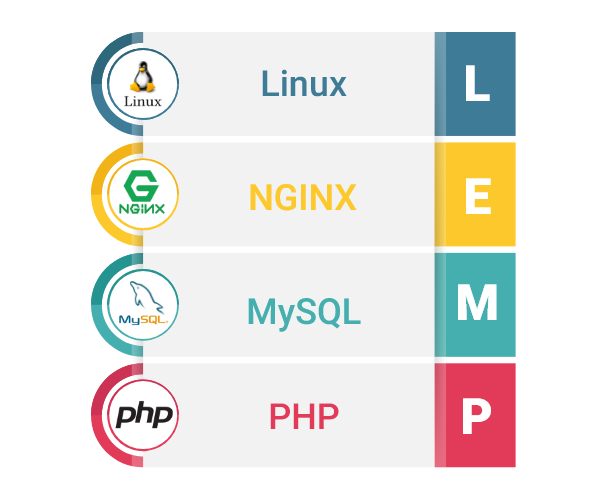

# LEMP Stack

In dit hoofdstuk bespreken we de meest gebruikte toepassing van Linux servers. 94% van alle webservers in de wereld maken gebruik van Linux[^stats]. Wij bekijken de mogelijkheden voor het hosten van dynamische en statische sites, ook bekijken we hoe deze te testen. Voor we beginnen moeten we en kijkje nemen naar de mogelijkheden van onze setup.

In Windows-land is de keuze snel gemaakt Microsoft heeft ASP.NET en IIS server. In ons Linux landschap zien we meer mogelijkheden (vele van deze werken ook op Windows). Veel hangt natuurlijk af van de applicaties die we willen hosten. In onze cursus bekijken we de meest populaire stack LAMP, maar aangepast aan de huidige trends en toekomstgericht te kunnen werken maken we er de LEMP stack van. Veel nieuwe termen maar laten we van het begin beginnen.

## Type websites

Vooraleer we een website gaan hosten moeten we nadenken wat we willen. Ruwweg genomen zijn er twee types website: "static" en "dynamic".
Historisch gezien waren de eerste websites "static". Het web was ontworpen met het fenomeen van paginas met informatie die konden linken naar andere paginas met informatie, van dezelfde auteur of een andere auteur. In 1989 door Tim Berners-Lee bedacht kreeg het internet hoe we het vandaag kennen vorm in het Hypertext Transfer Protocol (HTTP). Het keyword is "Hypertext" de hyper hier wordt bedoeld dat tekst niet lineair is, de gebruiker kan doormiddel van "hyperlinks" ronddwalen op het net (tot je beseft dat het 3 uur 's nachts is en je nog op wikipedia willekeurige artikelen aan het lezen bent).

HTTP kende enorme* populariteit al van de start voor het verspreiden van informatie.  
(* enorm binnen de academische wereld, enkel degenen op het internet, vergeleken met concurrerende protocollen als Gopher)

Websites waren zoals de autheur ze in HTML (HyperText Markup Language) geschreven had. Zelf iets toevoegen aan het web deed je niet door een instagram foto te posten maar door een eigen server te hosten, met je eigen inhoud linkend naar andere websites[^webring].

Al in midden jaren 90 kwam de nood voor meer. Websites manueel aanpassen vraagt veel werk, al snel kwam "Server-side scripting" op (samen met de introductie van client-side door Netscape's JavaScript). Talen als ASP, ColdFusion, Perl, PHP, Python,... werden ontworpen om webservers per gebruiker een aangepaste pagina te geven. Aangepast aan de huidige tijd, informatie uit een databank, zelfs vele sites boden hun server statistieken openbaar aan.

Rond het jaar 2000 maakte server-side scripting een grote impact op de wereld, sites zoals Amazon maakte het makkelijk om op het internet te winklelen. "Web 2.0" werd een grotere revolultie waarbij mensen aan het internet konden bijdragen zonder een eigen domein of server. Van blogs met commentaar op "Blogger" of video's op YouTube. Later Netlog, MySpace, Facebook, Twitter,...

Het dynamische web maakt het mogelijk om zonder aanpassingen aan je site content aan te passen, te hosten, of zelfs hele applicaties op het internet te hosten.

## Stacks

In informatica spreken we vaak over "softwarestacks". Deze stacks is een combinatie van verschillende software componenten die je kan gebruiken om een programma te bouwen en te hosten. Onze software gaat voorbouwen op deze stack en alle componenten benutten.

Vaak houd een softwarestack het volgende in:

- Een besturingssysteem
- Een database
- Een web server
- Een programeertaal
- Soms ook een programmeerframework

Deze stacks zijn gebouwd uit een combinatie van deze componenten.
Twee bekende voorbeelden in hedendaagse stacks zijn: LAMP en MEAN. LAMP is een stack met Linux, Apache, MySQL en PHP. MEAN is een stack met MongoDB, Express, AngularJS en NodeJS. Vaak zijn stacks geordend om een leuk Engels woord te vormen.
Developers kiezen vaak voor een stack die hun applicatie goed ligt, ook wordt er vaak een populair stack gekozen voor goede documentatie, stabiliteit en het vinden van kennis.

Voor deze cursus bekijken we als programeertaal PHP. PHP is een open source progameertaal die veel wordt gebruikt voor het web. PHP kent zijn oorspron ook als taal voor dynamische websites. We vinden PHP terug op meeste "kleinere" websites maar ook bij technologie giganten als Facebook[^hack].

### LAMP

LAMP staat voor:

- Linux
- Apache
- MySQL/MariaDB
- PHP

LAMP is een schoolvoorbeeld van een stack, en ongetwijfeld een van de meest populaire stacks.
Apache hier is de webserver die HTTP requests verwerkt. MySQL is databases die je data opslaat en SQL queries mogelijk maakt. Na overname van MySQL door Oracle kende de fork van MySQL MariaDB meer en meer populariteit (we bekijken dit in het hoofdstuk databases. PHP is onze taal die onze dynamische webpages gaat maken.

### Apache

De Apache HTTP Server is een open-source cross-platform web server dat ook gekend is als “httpd’ en gewoon "Apache".
De Apache Software Foundation is verantwoordelijk voor de benamingen en dienstverlening van Apache. De software wordt ontwikkeld en onderhouden door de open-source community met tal van ontwikkelaars. Apache is meestal gebruikt op het Linux-platform, en zorgt voor het mogelijk maken van vrijwel 30% van alle websites ter wereld[^stats]. In December 2020 was dit 36% en in december 2019 was dit 41%.

### LEMP

[^lempimagesource]

LEMP is een stack gelijk aan LAMP. Echter is Apache vervangen door NGINX (uitgesproken en-jin-ex).

NGINX is een open source webserver gestart in 2002 door Igor Sysoev, ontworpen voor 10 000 gelijktijdige connecties te kunnen behandelen op een efficiente manier. Een probleem wat webservers in die tijd door gelimiteerde resources en operating systems moeilijker konden behandelen. Echter het design van NGINX zorgt ervoor dat op de dag van vandaag NGINX veel perfomanter is dan Apache. Samen met ingebouwde functionaliteiten als [een Reverse Proxy](https://devops.maartje.dev/tools/loadbalancing/) is het ook ideaal voor het uitbouwen naar grotere en toekomstgerichte applicaties.

[^stats]

Hierdoor heeft NGINX een grotere market share dan Apache sinds enkele jaren. Bedrijven als Cloudflare die enorme aantallen webverkeer behandelen gebruiken ook een aangepaste versie van de NGINX code!

Hierdoor gaan we in deze cursus NGINX gebruiken in plaats van Apache.

## Standalone vs CGI

Een klein verschil om nog aan te halen gaat over de programmeertaal in een stack. Er zijn twee types van manieren om code uit te voeren op een webserver. De eerste is CGI (Common Gateway Interface) en is een spec die al van begin jaren 90 vastligt om code laten uit te voeren door webservers. Als een gebruiker een CGI website bezoekt word de file name meegegeven in de URL zoals met statische websites. De webserver herkent de file, start een Linux proces om de code uit te voeren en stuurt de inhoud door naar de gebruiker. Elke request start dus een proces op de server. Geen requests geeft ook geen CPU aan deze code files.

Vele (vaak moderne) applicaties onvervinden traagheid doordat de webserver elke keer de file moet lezen, code comilen en uitvoeren. Of de applicatie werkt met real-time data (neem bijvoorbeeld een chat applicatie) en moet achtergrond processen kunnen draaien. Deze werken dan vaak met een "standalone" server. De code zelf bevat een HTTP server die de requests verwerkt. Dit proces draait dan net als NGINX en MariaDB op onze server als een "service". Vaak draait NGINX nog voor deze server voor HTTPS af te handelen of om de applicatie geen root privileges te moeten geven (soms ook voor caching etc.).
Voorbeeld is de MEAN stack die een web server draait met de code erin met ExpressJS.

[^stats]: [Cijfers van w3tech.com](https://w3techs.com/technologies/overview/web_server)
[^webring]: Voor zoekmachines een ding waren hadden we [Webrings](https://en.wikipedia.org/wiki/Webring) waarmee sites over een bepaald onderwerk naar elkaar refereerde
[^hack]: Facebook is gebouwd op de LAMP stack maar kende een [transitie naar Hack, een taal ontworpen door FB om PHP sneller en op grote schaal te draaien](https://www.cuelogic.com/blog/how-facebook-is-not-using-php-by-still-using-php)
[^lempimagesource]: Afbeelding van Parth Shukla, Ahex Technologies
