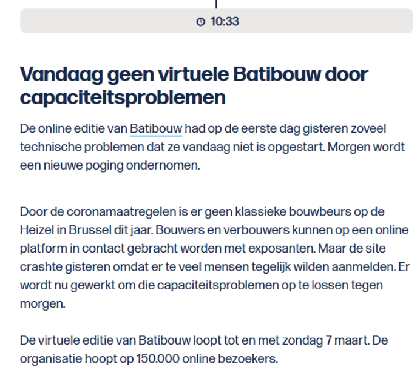
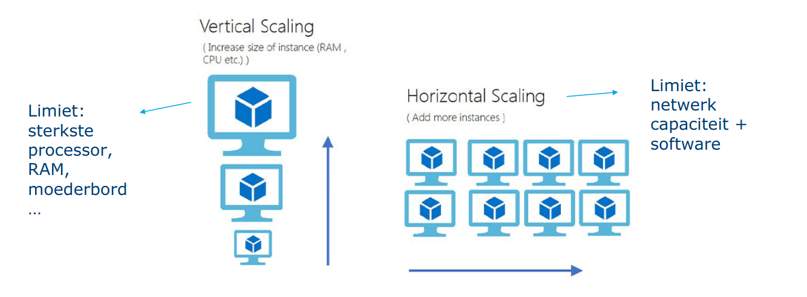
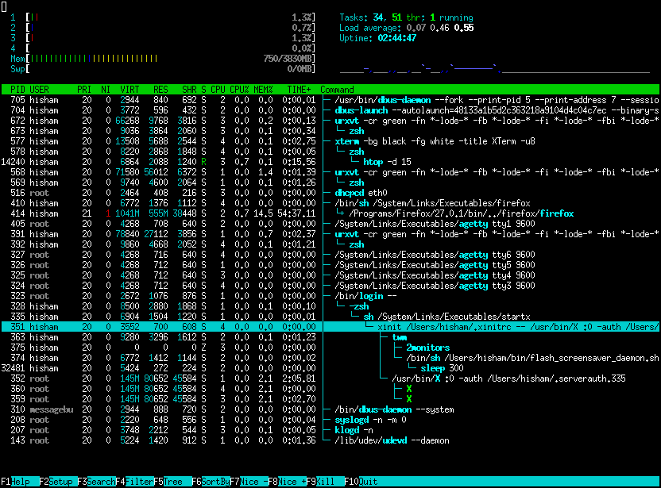

# Loadtesting

In dit hoofdstuk gaan we bekijken hoe we onze server en website gaan loadtesten. We gaan speciale software gebruiken om onze website veel bezoekers te geven om zo te bekijken hoe onze server gaat reageren.

## Waarom

Als de COVID-19 crisis ons een iets op vlak van IT had geleerd dan is het wel dat we moeten loadtesten! Vele in-persoon evenementen werden vervangen door online alternatieven. Hierdoor regende het klachten over trage of zelfs onbereikbare websites in deze periode.

In Maart 2021 vond een online Batibouw event plaats, deze kende een groot success waardoor velen wouden aanmelden op het platform op het begin van de dag. De servers konden echter deze grote aantallen niet aan, het event heeft zelfs enkele dagen moeten sluiten hierdoor.



Terwijl het aantal bezoekers voorspellen misschien niet altijd mogelijk is kunnen we in ons vak wel garatnies kunnen gaan stellen of een bepaald aantal bezoekers gevolgen gaat hebben. Dit doen we ondermeer door loadtesting. We kunnen een groot aantal simultane aanmeldingen gaan simuleren waardoor we een beeld krijgen van hoe de server gaat reageren, bottlenecks opsporen en misschien plannen kunnen opstellen voor op te schalen.


Hetzelfde verhaal zagen we gebeurek bij Smartschool in de eerste "afkoelingsweek" (hierin werd online onderwijs verplicht voor alle leerlingen). Smartschool ondervond problemen met het grote verkeer naar het platform. Ook dit konden we vermijden door een test uit te voeren op de server of we inderdaad alle leerlingen die op dezelfde moment aanmelden kunnen behandelen.

## Definitie

Load testen is het simuleren van het gebruik van een service door meerdere gebruikers.
Meestal voor software die door meerdere gebruikers simultaan gebruikt kunnen worden, zoals in ons geval webservers.
Je kan ook andere software testen, zoals bv. een tekstverwerker door het in te laden met een heel groot bestand, ook dat is loadtesting.

De meest nauwkeurige tests simuleren effectief gebruik in plaats van theoretisch gebruik. Dit vereist echter meestal speciale software of een script gemaakt voor de gehoste applicatie.
We kunnen zo bijvoorbeels 1 000 000 pogingen om in te loggen simuleren tegenover 1 000 000 pogingen om de pagina op te vragen die een "off the shelf" tool ons geeft. Dit eerste gaat een hele interactie simuleren en geeft ons meer zekerheid.

Load testing staat je toe de Quality of Service (QoS) te meten. Dit geeft ons een beschrijving en meting van de kwaliteit en performantie van een service.We maken eem meeting van een 'system/software under test' (SUT) of 'device under test' (DUT).
Hierin kijken we naar een paar eigenschappen:

- CPU
- Geheugen
- Schijfactiviteit
- Response tijd

Uit goede loadtesting kunnen we problemen gaan opsporen, die problemen kunnen voortkomen uit:

- De software dat getest word
- De database server
- Netwerk: latency, congestie
- Client-side problemen
- Load balancing

Heb je in de bedrijfswereld een Service Level Agreement (SLA) afgesloten dan moet je deze gaan bewijzen door middel van loadtesting.
Eeen SLA contract (binnen bedrijven is dit vaak ook tussen afdelingen) gaat bepaalde eisen van diensten vastleggen.

Hier kan onderandere instaan:

- Beschikbaarheid van de dienst: de hoeveelheid tijd dat de dienst beschikbaar is voor gebruik. Dit kan worden gemeten in percentages van tijd, met bijvoorbeeld 99,5 procent beschikbaarheid. Dat geeft ons 7m 12s per dag dat onze server niet bereikbaar is, je kan dit berekenen met de [uptime Calculator](https://uptime.is/). In moderne IT toepassingen spreken we in "nines" omdat we meestal voor 99,9% gaan of 99,99% enz.
- Defectpercentages: percentages van fouten die mogelijk zijn. Productiefouten zoals onvolledige back-ups en restores, coderingsfouten/rework, en gemiste deadlines kunnen in deze categorie worden opgenomen. Ook bijvoorbeeld een percentage dataloss zo kan een backupdienst 99.9999% zekerheid geven je data niet te verliezen.
- Onderhoudsmelding: in een SLA kan ook staan hoe ver op voorhand een mogelijk onderhoud moet gemeld worden en binnen welke uren dit uitgevoerd mag worden.
- Support: heel vaak staat in een SLA ook hoe snel een support ticket behandeld (niet opgelost) moet worden, zo kan je bijvoorbeeld bij je internet provider een contract afsluiten dat zegt dat binnen 5 uur een technieker ter plaatste moet komen.
- Veiligheid: controleerbare beveiligingsmaatregelen zitten vaak ook vervat in een SLA: zoals antivirusupdates en patching tijden. Dit is vaak is essentieel om aan te tonen dat alle redelijke preventieve maatregelen zijn genomen, mocht zich een security incident voordoen.
- Performance: perfomantie onder een bepaalde druk staat ook vaak in een SLA. Hiermee kunnen we bijvoorbeeld bepalen dat een aantal gebruikers binnen een bepaalde laadtijd hun website kunnen laden.

### Stress testing?

Wanneer je test hoeveel je gebruikers je SUT of software aankan, wordt het ook stress testing genoemd
De lijn tussen load testing en stress testing is vaag. Wanneer je tijdens de load test merkt dat de service traag en niet-responsief wordt is het geen load test meer maar een stress test.

Je kan kortweg zeggen dat een stresstest tot grotere uitersten gaat om de limieten van een systeem te gaan ontdekken.

### Terminologie

- Networklatency: hoe snel de server reageert op een aanvraag

  - Wordt vaak ook reactietijd (response time) genoemd
  - Gemeten in ms. Lagere cijfers betekenen dat de reactietijd sneller is
  - Gemeten vanaf de client, dus netwerkoverhead zit mee in de tijd
    - Dit kan ook een bottleneck zijn die we moeten bekijken

- Doorvoercapaciteit/throughput: hoeveel aanvragen de server kan behandelen in eenspecifiek tijdskader
  - Meestal gerapporteerd in requests per seconden

## Scaling

Hoe schalen we nu een systeem op? We hebben twee mogelijkheden:

**Vertical scaling:** dit is de simpelste methode om servers te schalen. We voegen aan 1 server meer resources toe, meer CPU, meer RAM,... Dit werkt vlot en makkelijk tot op een bepaald niveau waar er geen betere hardware meer te krijgen is. Ook komt dit in vele gevallen duur uit, vooral als we gespecialiseerde hardware moeten aanschaffen.

**Horizantal scaling:** in theorie lijkt het simpel, we kopen meer servers aan om het verkeer onder te verdelen. Dit is echter niet zo makkelijk voor elk systeem, we moeten een verdeling kunnen maken op het verkeer zelf zonder dat gebruikers er last van krijgen. De software moet hier ook op voorzien zijn dat verkeer over servers gedeeld word. We hebben wel veel grotere ruimte voor uitbreiding, de grootste limittiefactoren zijn hier budget en software.



In praktijk komen vaak combinaties voor. Zo zal een webapplicatie zelf eerder horizontaal opgeschaald worden en de achterliggende database vlugger verticaal omdat het opsplitsen van een relationale databank veel moeilijker is.

## Webserver load testing

We hebben in de afgelopen lessen een dynamische website opgezet op onze eigen server. We gaan deze nu ook loadtesten.

Wr gaan in dit hoofdstuk HTTP verkeer naar omnze webserver simuleren om enkele vragen te beantwoorden

- Heeft de server genoeg resources (CPU, RAM, ...) om de aanvragen af te handelen?
- Reageert de server snel genoeg?
- Reageert de applicatie snel genoeg?
- Moeten we eventueel verticaal of horizontaal schalen om aan de eisen te voldoen?
- Zijn er specifieke pagina's of aanvragen die traag lopen?

### Het testplan

:::warning note
Deze stap in praktijk makkelijker als we een uitgebreide monitoring hebben zoals prometheus, collectd, icinga, etc... Dit zien we in het vervolgvak [DevOps](https://devops.maartje.dev/tools/grafana-prometheus/)!
:::

### Stap 1: resources bekijken

We moeten zorgen dat we server resources kunnen bekijken. Zo kunnen we al een zicht hebben op de capaciteit die onze server bezit.

**Geheugen:**

```bash
free -m
```

Met `free` kunnen we de huidige geheugengebruik bekijken. `-m` geeft aan dit in Megabyte te doen, alternatieven zijn `-g` voor gigabyte (afgerond) of `-h` voor automatiche afronding.

```
$ free -m
               total        used        free      shared  buff/cache   available
Mem:           31819        4486       19613        1025        7719       25857
Swap:           2047           0        2047
```

We zien hier het gebruik van het RAM geheugen als ook de Swap die in gebruik is.
We hebben een aantal kolommen:

- `total`: het totale geheugen dat de server heeft
- `used`: het totale geheugen dat in gebruik is
- `free`: het totale geheugen dat nog **leeg** is
- `shared`: hoeveel gebeugen gebruikt wordt door `tmpfs` als "RAM-disk" voor processen in Linux
- `buff/cache`: hoeveel geheugen gebruikt wordt door caching van de harde schijf
- `available`: hoeveel gehheugen die beschikbaar is voor gebruik (`free` + `buff/cache`, want de cache is niet essentieel, enkel voor extra snelheid)

**CPU:**

```bash
mpstat
```

Met `mpstat` kunnen we hetzelfde bekijken als `free` maar dan voor de CPU.

```
Linux 5.13.0-30-generic	03/03/2022 	_x86_64_	(8 CPU)

11:55:35 AM  CPU    %usr   %nice    %sys %iowait    %irq   %soft  %steal  %guest  %gnice   %idle
11:55:35 AM  all    5.67    0.02    1.92    0.18    0.00    0.14    0.00    0.00    0.00   92.06
```

We zien hier het uitgedrukt in procenten.

- `usr`: percentage van CPU tijd gebruikt door user processen
- `nice`: de CPU gebruik door de gebruiker in `nice` mode, dit zijn achtergrond proccessen die heel traag mogen gaan
- `sys`: percentage van CPU tijd gebruikt door de Linux kernel
- `iowait`: percentage van CPU tijd waar we wachten op de harde schijf
- `irq`: percentage van CPU tijd gebruikt door hardware interrupts
- `soft`: percentage van CPU tijd gebruikt door software interrupts
- `steal`: percentage van de tijd dat het systeem wacht op een CPU, dit zien we in VMs, als dit hoog is betekend dat andere VMs onze CPU tijd "stelen"
- `guest`: percentage van CPU tijd gebruikt door VMs in onze server
- `gnice`: ercentage van CPU tijd gebruikt `nice` processen van VMs
- `idle`: percentage van CPU tijd dat niet in gebruik is

**Beide (live):**

De bovenste commandos geven ons enkel een momentopname. We kunnen met `watch` ze wel automatisch updaten maar we hebben betere tools om dit te doen.

De eerste is de bekentste:

```bash
top
```

`top` toont een combinatie van de bovenstaande commandos. Alsook een processenlijst.

We kunnen een stapje verder gaan met het nieuwere `htop`:

```bash
htop
```

`htop` is een verbeterde top die ook grafische weergave geeft. Alsook een indicatie in kleuren en vele uitbreidmogelijkheden!



`htop` is geliefd in de community en draait op vele systemen [zoals je op hun site kan zien](https://htop.dev/screenshots.html)

:::warning TIP
We gaan deze commando's willen uitvoeren tijdens het testen, we kunnen best 2 terminal vensters naast elkaar gaan gebruiken! 1 met `htop` en 1 voor onze testen.
:::

### Stap 2: maximum doorvoercapaciteit vinden

:::warning note
Normaal zou je deze stappen op twee verschillende computers uitvoeren.
Wij doen het op dezelfde server, wat de resultaten minder betrouwbaar gaat maken omdat onze server load ondervind van zijn eigen test software..
Maar het werkt wel heel goed om de begrippen en basis uit te leggen.
:::

We gaan opzoek naar de limieten van onze server. We gaan zoveel mogelijk aanvragen versturen. Hiermee meten we de grenzen van onze doorvoercapaciteit.

We gaan merken dat onze server veel capaciteit gaat hebben maar ten koste van snelheid. Terwijl in theorie we dit dus aankunnen is het in praktijk niet zo.
Onze gebruikers gaan echter lastig worden als je webpagina 20 seconden duurt om te laden!

Uit onderzoek van Skilled blijkt dat 79% van klanten van webwinkels hun aankopen anuleren of niet meer terugkomen voor meer aankopen in de toekomst als ze de website "traag vinden" [^skilled]. 64% vindt dat een webpagina op een smartphone binnen 4 seconden moet geladen zijn, 47% zegt zelfs dat dat 2 seconden op een desktop moet zijn.

We gaan dus ons maximum terugscrhoeven tot een aanvaardbaare laadtijd om onze praktische maximum doorvoercapaciteit te bepalen.

## wrk2

wrk2 is een een HTTP-benchmarkingstool, gebaseerd op wrk.

wrk2 is wrk aangepast en verbeterd om een constante doorvoerbelasting te produceren, en nauwkeurige latency details tot in de hoge 9's.
wrk2 (net als wrk) is een modern HTTP-benchmarkinghulpmiddel dat in staat is om een aanzienlijke belasting te genereren wanneer het op een enkele multi-core CPU wordt uitgevoerd, het maakt gebruik van meerdere CPU threads om efficient requests te versturen.

Een optioneel Lua script kan HTTP requests genereren, responses verwerken, en aangepaste rapportage uitvoeren. We gaan dit niet in de cursus gebruiken maar in de praktijk kan je zo volledige gebruiker interacties simuleren!

### Installatie

wrk2 is niet in APT te vinden, maar het in in C geschreven dus het zelf gaan compileren is een goede optie. We gaan ook de fork van [Kinvolk](https://kinvolk.io/) gebruiken, deze bevat een aantal handige bug fixes als ARM compatibiliteit.

```bash
sudo apt update
sudo apt install build-essential libssl-dev git zlib1g-dev
```

Hiermee installeren we de benodigde software om C-code te compileren als ook een paar libraries die wrk2 gebruikt.

```bash
mkdir ~/src && cd ~/src
git clone https://github.com/kinvolk/wrk2.git
cd wrk2
```

We maken een map en kopieren de code van de GitHub repository naar deze map.

```bash
make
```

Vervolgens compileren we de code.

```bash
sudo cp wrk /usr/local/bin
cd ~
rm -rf ~/src/wrk2
```

Tenslotten verplaatsen we de binary en ruimen we de code weer op.

### Gebruik

We gaan wrk2 gebruiken om onze maximum doorvoer te zoeken

```bash
wrk -t10 -c10 -d30s -R10000 http://localhost
```

De opties:

- `-t`: hoeveel CPU thread er gebruikt worden door het programma wrk
- `-c`: hoeveel connecties er open moeten blijven
- `-d`: duurtijd van de test
- `-R`: throughput in requests/sec (total). Dit zetten we heel hoog om ons maximum te vinden

Als we dit gaan uitvoeren krijgen we iets als:

```
$ wrk -t10 -c10 -d30s -R10000 http://localhost
Initialised 10 threads in 1 ms.
Running 30s test @ http://localhost
  10 threads and 10 connections
  Thread calibration: mean lat.: 1.306ms, rate sampling interval: 10ms
  [...]
  Thread Stats   Avg      Stdev     Max   +/- Stdev
    Latency     1.27ms    0.93ms  27.82ms   94.38%
    Req/Sec     1.05k   110.19     2.78k    81.10%
  299993 requests in 30.00s, 119.00MB read
Requests/sec:   9999.50
Transfer/sec:      3.97MB
```

Met een maximum van 9999 requests/sec van de 10 000 die we vroegen zien we dat onze server geen problemen heeft! Onze grootste response time was 27ms wat goed is.

We hebben dit wel over de loopback interface getest, misschien niet realistisch... We gebruiken onze externe interface voor de volgende test:

```
$ wrk -t10 -c10 -d30s -R10000 http://rnummer.stuvm.be
Initialised 10 threads in 1 ms.
Running 30s test @ http://lier.stuvm.be
  10 threads and 10 connections
  Thread calibration: mean lat.: 3311.794ms, rate sampling interval: 11771ms
  Thread calibration: mean lat.: 3393.139ms, rate sampling interval: 11886ms
  Thread calibration: mean lat.: 3385.360ms, rate sampling interval: 11845ms
  Thread calibration: mean lat.: 3349.928ms, rate sampling interval: 11763ms
  Thread calibration: mean lat.: 3345.097ms, rate sampling interval: 11755ms
  Thread calibration: mean lat.: 3362.592ms, rate sampling interval: 11821ms
  Thread calibration: mean lat.: 3363.478ms, rate sampling interval: 11788ms
  Thread calibration: mean lat.: 3364.863ms, rate sampling interval: 11829ms
  Thread calibration: mean lat.: 3340.271ms, rate sampling interval: 11812ms
  Thread calibration: mean lat.: 3361.703ms, rate sampling interval: 11902ms
  Thread Stats   Avg      Stdev     Max   +/- Stdev
    Latency    13.07s     3.74s   19.66s    57.94%
    Req/Sec   350.50      1.50   352.00     90.00%
  103839 requests in 30.00s, 38.62MB read
Requests/sec:   3461.15
Transfer/sec:      1.29MB
```

3461.15 requests/sec is al wat minder dan de 10 000 requests/sec die we gevraagd haddenm we zien ook een maximum laadtijd van 19 seconden!
We zijn hier al over onze doorvoervoercapaciteit overschreden!

:::warning StuVM Netwerk

Waarom dit grote verschil? daarvoor moeten we even bekijken hoe StuVM is gebouwd.


Omdat we 1 IP naar buiten hebben gebruiken we een [speciale proxyserver](https://github.com/meyskens/sniproxy) die op basis van de domeinnaam verkeer gaat doorsturen naar de juiste server op TCP niveau.

In een normale klassetting gaan we ~30 loadtests tegelijk draaien tegen onze connectie, en onze proxy server. Dit gaat onze bottleneck zijn in dit scenario. We gaan dit omzijlen door het IP adres van je domein lokaal te overschrijven naar onze localhost.

```bash
sudo nano /etc/hosts
```

We voegen onderaan de volgende regel toe:

```
127.0.0.1 r<nummer>.stuvm.be wordpress.r<nummer>.stuvm.be php.r<nummer>.stuvm.be
```

:::

Een statische pagina laden kan NGINX heel snel, het is er ook voor ontworpen om duizenden requests te doen.
We hebben in vorig hoofdstuk WordPress opgezet, dit gaat al een leukere test worden.

```bash
wrk -t10 -c10 -d30s -R10000 http://wordpress.r<nummer>.stuvm.be
```

We zien een heel duidelijk verschil! Met 48 requests/sec krijgen en een maximum laadtijd van 29 seconden!

```
$ wrk -t10 -c10 -d30s -R10000 http://wordpress.r<nummer>.stuvm.be
Initialised 10 threads in 1 ms.
Running 30s test @ http://wordpress.lier.stuvm.be
  10 threads and 10 connections
  Thread calibration: mean lat.: 5771.160ms, rate sampling interval: 18071ms
  [...]
  Thread Stats   Avg      Stdev     Max   +/- Stdev
    Latency    19.94s     5.73s   29.84s    57.89%
    Req/Sec     5.00      0.00     5.00    100.00%
  1452 requests in 30.01s, 76.27MB read
Requests/sec:     48.38
Transfer/sec:      2.54MB
```

We nemen nu de `48` requests/sec die we kregen en gebruiken deze als doorvoercapaciteit.

```bash
wrk -t10 -c10 -d30s -R48 http://wordpress.r<nummer>.stuvm.be
```

We zien dat onze laadtijden nu redelijk zijn geworden:

```
$ wrk -t10 -c10 -d30s -R48 http://wordpress.r<nummer>.stuvm.be
Initialised 10 threads in 1 ms.
Running 30s test @ http://wordpress.lier.stuvm.be
  10 threads and 10 connections
  Thread calibration: mean lat.: 119.670ms, rate sampling interval: 334ms
  [...]
  Thread Stats   Avg      Stdev     Max   +/- Stdev
    Latency   169.06ms   58.07ms 336.64ms   60.64%
    Req/Sec     4.28      1.20     8.00     89.98%
  1438 requests in 30.01s, 75.53MB read
Requests/sec:     47.92
Transfer/sec:      2.52MB
```

Als de waardes hier in een aanvaardbare schaal liggen, voer de R waarde weer terug op tot we net een aanvaardbare waarde hebben.
Als je dat berijkt heb heb je het echte maximum doorvoer!

### mysqlslap

We hebben een loadtest gezien voor onze HTTP server. We hebben hier al eens NGINX kunnen isoleren maar ook een volledige test uitgevoerd door WordPress te loadtesten. Dit zette ook MariaDB onder druk.
We hebben ook een aparte test voor MariaDB zelf te kunnen loadtesten.

`mysqlslap` is een tool die we gebruiken om een loadtest uit te voeren op onze database. We voeren even het commando uit:

```bash
sudo mysqlslap
```

Nu krijgen we een error...

```
$ sudo mysqlslap
mysqlslap: unknown variable 'default-character-set=utf8mb4'
```

Nu blijkt er in de recente versies van MariaDB een variable verwijderd te zijn die Ubuntu nog wel altijd mee geeft in de standaard installatie.
We gaan deze even in commentaar zetten zodat we `mysqlslap` kunnen uitvoeren.

```bash
sudo nano /etc/mysql/mariadb.conf.d/50-client.cnf
```

We passsen de configuratie aan zodat we het volgende hebben:

```
#default-character-set = utf8mb4
```

Nu kunnen we een loadtest uitvoeren:

```bash
sudo mysqlslap --auto-generate-sql --verbose
```

met `--auto-generate-sql` gaan we vragen om automatisch een database te maken en daarop te testen, en `--verbose` zorgt ervoor dat we meer output krijgen.

```
$ sudo mysqlslap --auto-generate-sql --verbose
Benchmark
	Average number of seconds to run all queries: 0.115 seconds
	Minimum number of seconds to run all queries: 0.115 seconds
	Maximum number of seconds to run all queries: 0.115 seconds
	Number of clients running queries: 1
	Average number of queries per client: 0
```

Veel load zien we nog niet want mysqlslap heeft maar 1 gelijktijdige test uitgevoerd.
Met het volgend commando vragen we 50 gelijktijdige connecties, die de query 10 keer uitvoert

```bash
sudo mysqlslap --concurrency=50 --iterations=10 --auto-generate-sql --verbose
```

We krijgen nu al wat meer load te zien:

```
$ sudo mysqlslap --concurrency=50 --iterations=10 --auto-generate-sql --verbose

Benchmark
	Average number of seconds to run all queries: 0.293 seconds
	Minimum number of seconds to run all queries: 0.236 seconds
	Maximum number of seconds to run all queries: 0.429 seconds
	Number of clients running queries: 50
	Average number of queries per client: 0
```

De tabel die gemaakt wordt is heel simpel, deze kunnen we iets uitgebreider maken: we voegen 5 numerieke kolommen toe en 20 character kolommen:

```bash
sudo mysqlslap --number-int-cols=5 --number-char-cols=20 --concurrency=50 --iterations=10 --auto-generate-sql --verbose
```

```
$ sudo mysqlslap --number-int-cols=5 --number-char-cols=20 --concurrency=50 --iterations=10 --auto-generate-sql --verbose

Benchmark
	Average number of seconds to run all queries: 0.854 seconds
	Minimum number of seconds to run all queries: 0.746 seconds
	Maximum number of seconds to run all queries: 1.037 seconds
	Number of clients running queries: 50
	Average number of queries per client: 0
```

Met `mysqlslap` kunnen we ook een loadtest uitvoeren op onze database, waarmee we ook weer een beter beeld kunnen krijgen van de capaciteiten van onze server.

## The Next Generation: Horizontal Autoscaling

We hebben verschillende manieren gezien om op te schalen. Nu met meer en meer servers in de cloud kan je meestal in een aantal clicks gaan schalen.
Maar we kunnen dit ook automattisch doen!

We nemen een kijkje in de Kubernetes wereld: [Horizontal Pod Autoscaling](https://kubernetes.io/docs/tasks/run-application/horizontal-pod-autoscale/) is een mechanisme dat constant load op servers (containers om exact te zijn) gaat monitoren, hierna gaat het systeem conclusies over de load trekken en eventueel meer containers bijmaken voor load onder te verdelen. Een stap verder is om een API van je cloudprovider te kunnen gebruiken om servers bij te huren om zo uit te breiden. Zo kunnen pieken in verkeer perfect automatisch opgevangen worden. In praktijk zien we dit echter nog niet enorm veel gebruik jammergenoeg.

Het omgekeerde bied ook nut, meeste websites zien verkeer in een sinusvorm in netwerkverkeer, gelinkt aan het moment van de dag. Zo zal outlook pieken tijdens kantooruren en Netflix dan weer rond 8 uur in de avond. In het midden van de nacht heb je dan misschien weer minder servers nodig. Autoscaling gaat dit ook kunnen beheren om efficienter met servers om te gaan.

[^skilled]: [https://skilled.co/resources/speed-affects-website-infographic/](https://skilled.co/resources/speed-affects-website-infographic/)
