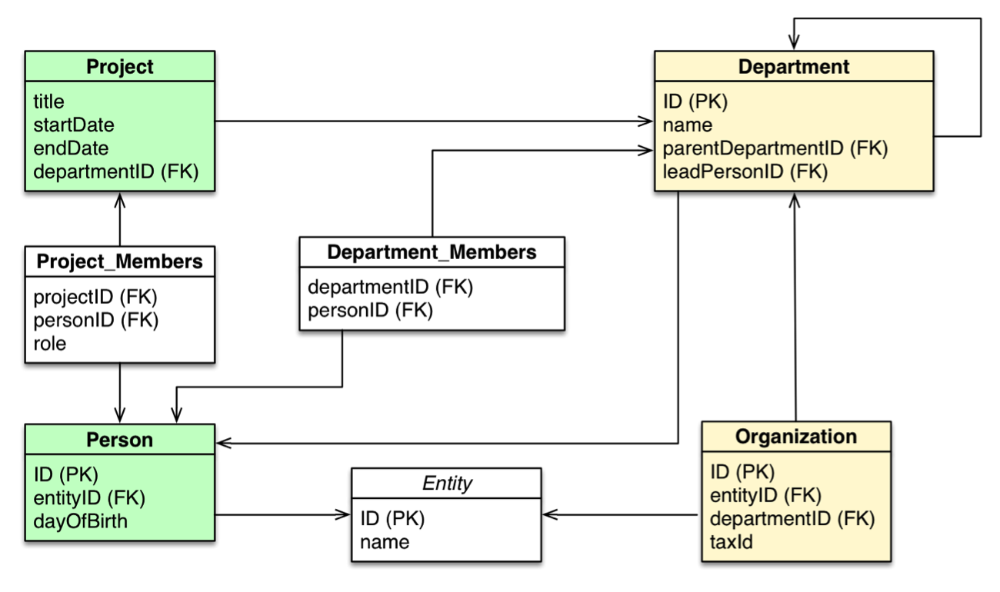

# MariaDB

Wanneer we een applicatie hosten gaan we gegarandeerd werken met data. Het beheren van data is een belangrijke taak die meestal door een database wordt gedaan.
Onze database server gaat voor ons data opslaan, beheren, doorzoeken en en toegangkelijk stellen aan gebruikers en systemen.

Een software pakket dat databases gaat hosten is gekend ald een Database Management System (DBMS)

## Databases

Databases zijn er in alle soorten en maten. De juiste keuze is vooral afhankelijk van het type data dat je wil opslagen. Maar ook perfomantie en de hoeveelheid data spelen een grote rol in de keuze. We gaan hier vershillende type databases even bekijken:

- Relationele database

  - Maakt gebruik van Structured Query Language (SQL)
  - Meest bekende en gebruikte databases

- NoSQL database (Not only SQL / non SQL)
  - Key/value database
    - Redis
    - Memcached
  - Document Store
    - MongoDB
    - CouchDB
  - Column Store
    - Cassandra
  - Graph database
    - Neo4j

### Key / value database

Data wordt opgeslagen enkel als een sleutel (key) die naar bepaalde data (value) wijst.
Er zijn wel een aantal voorwaarden zoals dat de sleutel uniek is en dat de value niet leeg is.

Deze zien we enorm vaak terugkomen voor caching van gegevens. Zo kunnen we bijvoorbeeld resultaten complexe berekingingen opslagen per gebruiker (bijvoorbeeld een saldo van een bankrekening). Deze resultaten kunnen dan snel opgeroepen worden met een unieke sleutel (zoals een rekeningsnummer). Vele key/value stores bieden ook de mogelijkheid om data in het RAM geheugen te bewaren.


Voorbeelden van key/value databases:

- [Redis](https://redis.io/)
- [Memcached](https://memcached.org/)
- [Etcd](https://etcd.io/)

### Document Store

Een document store database slaat elk record op als een (semi)gestructureerd document.
Alle Relevante info over een object wordt opgeslagen in het document. Vaak worden er geen relaties, in tegenstelling tot een relationele databank, gelegd tussen objecten. Maar in moderne document stores kunner er wel relaties gelegd worden.

Een groot voordeel van onze document store is dat deze enorm makkelijk horizontaal te schalen zijn. Daarmee bedoelen we dat we de database makkelijk over verschillende servers kunnen spreiden met de minimale inspanning van onze database server om te weten welke objecten waar in de database zitten.

Mogelijkheid tot queries schrijven kan meestal in een bijpassende taal voor waar onze documenten in geschreven zijn. Zo XQuery kan XML querien, en kunnen we JavaScript queries schrijven voor JSON (JavaScript Object Notation) documenten.

Documenten zijn vaak geschreven in JSON (JavaScript Object Notation):
Dit is een voorbeeld van een BSON (Binary methode on JSON op te slagen) document in MongoDB:

```json
{
  "_id": "5a0d7e9d0e7d6b1d2a8b4567",
  "name": "John Doe",
  "age": 30,
  "address": {
    "street": "Main St",
    "city": "New York",
    "state": "NY",
    "zip": "10001"
  },
  "children": [
    {
      "name": "Jane Doe",
      "age": 10
    },
    {
      "name": "Jack Doe",
      "age": 8
    }
  ]
}
```

Bekende servers zijn:

- [MongoDB](https://www.mongodb.com/)
- [Apache CouchDB](https://couchdb.apache.org/)
- [Amazon DocumentDB (AWS)](https://aws.amazon.com/documentdb/)

### (Wide) Column Store

Data in een colum store wordt opgeslagen in kolommen. Een column family bevat een of meerdere rijen.
Elke rij kan opzich zelf een verschillend aantal kolommen hebben, met een verschillend aantal datatypes.

Dankzij een hierachische structuur kunnen we snel en makkelijk data zoeken en opslagen. Tegevover een document of key/value database kunnen we wel meer structuur aanbrengen die veel weg heeft van onze relationele database.


Bekende servers zijn:

- [Google Cloud Bigtable](https://cloud.google.com/bigtable/)
- [Apache Cassandra](https://cassandra.apache.org/)
- [Apache HBase](https://hbase.apache.org/)

### Graph database

Een graph database maakt gebruik van een grafisch model van nodes en relaties tussen nodes om data op te slaan.
De data heeft geen schema, het belangrijkste is dat de nodes en relaties een unieke identificatie hebben.
Graph databases bestaan nog niet enorm lang maar kennen door grote gebruikers als Facebook wel een populatiteit.

Graph databases hebben een eigen query taal als GraphQL om data op te halen.


Bekende software:

- [Neo4j](https://neo4j.com/)
- [OrientDB](https://www.orientdb.org/)
- [Dgraph](https://dgraph.io/)

### Relationele database

Relationele databanken ken je normaal van de les SQL. Hier slaan we data op in tabellen met rijen en kolommen. Er zijn verschillende relaties tussen deze tabellen.



Bekende software:

- [MySQL](https://www.mysql.com/)
- [MariaDB](https://mariadb.org/)
- [Oracle Database](https://www.oracle.com/database/technologies/)
- [Microsoft SQL Server](https://www.microsoft.com/en-us/sql-server/)
- [PostreSQL](https://www.postgresql.org/)

## MariaDB

In onde cursus gebruiken we MySQL. MySQL maakt deel uit van de LAMP stack en is enorm populair bij gebruik met PHP applicaties door goede integratie. De MySQL server is ook makkelijk in gebruik.

MySQL was eerst onafhankelijk ontwikkeld met een open source licentie, met een proprietaire versie onderhouden door MySQL AB. Dit bedrijf werd overgenomen door SUN Microsystems, die zelf overgenomen werd door Oracle.
De reputatie van Oracle is al niet te goed in de open source wereld, ook dat Oracle al een eigen database heeft was geen goede voorspelling.
Daarom heeft de oprichter van MySQL [Michael "Monty" Widenius](https://en.wikipedia.org/wiki/Michael_Widenius) beslist MySQL te "forken" naar MariaDB.

:::info Naam
Waar komt de naam MariaDB vandaan? Monty had 3 kinderen: My (Finse meisjesnaam), Maria en Max.
My en Maria werden vereeuwigd in de MySQL wereld. Max kreeg ook een eigen database in de SAP wereld: MaxDB.
:::

MariaDB bestaat al sinds 2009. Buiten de visie op open source zijn de twee lichtjes een andere richting uit gegaan. Maar de prioriteit blijft liggen op een "drop in" replacement voor MySQL te zijn. We gaan dit ook merken in de installatie dat deze 99% hetzelfde werken en alle commandos compatibel zijn met MySQL.

Toch zijn er kleine verschillen:

- MariaDB voegt nieuwe SQL queries toe die niet in MySQL zijn.
- MariaDB voegt caching toe voor performance.
- MariaDB voegt ondersteuning doe voor Oracle's SQL dialect.
- MySQL heeft betalende functies voor betere scaling
- MySQL laat toe super users te limiteren

### Installatie

Voor installatie de package index updaten:

```bash
sudo apt update
```

Vervolgens gaan we MariaDB server installeren:

```bash
sudo apt install mariadb-server
```

Zoals altijd checken we of de server is gestart:

```bash
sudo systemctl status mariadb
```

MariaDB draait nu! MariaDB draait standaard op TCP poort `3306`.
We gaan geen firewall regels instellen voor MariaDB. Onze database houden we best op de server zelf zodat het publieke internet niet rechtstreks aan de database server kan geraken. In volgende lessen gaan we onze PHP code verbinden met de database.

### Configuratie

Nu we een MariaDB server hebben gaan we deze ook configureren! We gaan uitzonderlijk weinig met de configuratie bestanden zelf werken. Alle configuratie voor het dagelijks gebruik bevinden zich namelijk in de database zelf!

Toch gaan we een aantal parameters terugvinden in configuratie bestanden, in `/etc/mysql/` (deze map blijft zo voor compatibiliteit met MySQL).
Hier vinden we:

- `my.cnf` dit is de mysql compatibele configuratie
- `mariadb.cnf` dirt is de MariaDB-specifieke configuratie

We kunnen ook logs vinden in `/var/log/mysql/`.
Al onze data staat dan weer in `/var/lib/mysql/`.

MariaDB voorziet een handig script om configuratie te vergemakkelijken!
Allereerst gaan we MariaDB configureren om beveiligd te zijn:

```bash
sudo mysql_secure_installation
```

(standaard is er geen root passowrd, dus we gaan dat instellen)

Hiermee stellen we een root password in **voor MariaDB** dit is dus een ander password dan can onze Linux server.

```
NOTE: RUNNING ALL PARTS OF THIS SCRIPT IS RECOMMENDED FOR ALL MariaDB
      SERVERS IN PRODUCTION USE!  PLEASE READ EACH STEP CAREFULLY!

In order to log into MariaDB to secure it, we'll need the current
password for the root user. If you've just installed MariaDB, and
haven't set the root password yet, you should just press enter here.

Enter current password for root (enter for none):
OK, successfully used password, moving on...

Setting the root password or using the unix_socket ensures that nobody
can log into the MariaDB root user without the proper authorisation.

You already have your root account protected, so you can safely answer 'n'.

Switch to unix_socket authentication [Y/n] y
Enabled successfully!
Reloading privilege tables..
 ... Success!


You already have your root account protected, so you can safely answer 'n'.

Change the root password? [Y/n] y
New password:
Re-enter new password:
Password updated successfully!
Reloading privilege tables..
 ... Success!


By default, a MariaDB installation has an anonymous user, allowing anyone
to log into MariaDB without having to have a user account created for
them.  This is intended only for testing, and to make the installation
go a bit smoother.  You should remove them before moving into a
production environment.

Remove anonymous users? [Y/n] y
 ... Success!

Normally, root should only be allowed to connect from 'localhost'.  This
ensures that someone cannot guess at the root password from the network.

Disallow root login remotely? [Y/n] y
 ... Success!

By default, MariaDB comes with a database named 'test' that anyone can
access.  This is also intended only for testing, and should be removed
before moving into a production environment.

Remove test database and access to it? [Y/n] y
 - Dropping test database...
 ... Success!
 - Removing privileges on test database...
 ... Success!

Reloading the privilege tables will ensure that all changes made so far
will take effect immediately.

Reload privilege tables now? [Y/n] y
 ... Success!

Cleaning up...

All done!  If you've completed all of the above steps, your MariaDB
installation should now be secure.

Thanks for using MariaDB!
```

### Queries

Nu onze database beveiligd is gaan we een query gaan uitvoeren.

Eerst testen we of we kunnen verbinden met MariaDB door de versie nummer te vragen:

```bash
sudo mysqladmin version
```

```
mysqladmin  Ver 9.1 Distrib 10.5.13-MariaDB, for debian-linux-gnu on x86_64
Copyright (c) 2000, 2018, Oracle, MariaDB Corporation Ab and others.

Server version		10.5.13-MariaDB-0ubuntu0.21.10.1
Protocol version	10
Connection		Localhost via UNIX socket
UNIX socket		/run/mysqld/mysqld.sock
Uptime:			1 min 32 sec

Threads: 1  Questions: 486  Slow queries: 0  Opens: 171  Open tables: 28  Queries per second avg: 5.282
```

Als dit werkt kunnen we inloggen in de MariaDB shell:

```bash
sudo mysql -u root -p
```

`-u` geeft onze user, met `-p` zeggen we dat we een password willen gebruiken.

Nu krijgen we een MariDB shell:

```
Welcome to the MariaDB monitor.  Commands end with ; or \g.
Your MariaDB connection id is 56
Server version: 10.5.13-MariaDB-0ubuntu0.21.10.1 Ubuntu 21.10

Copyright (c) 2000, 2018, Oracle, MariaDB Corporation Ab and others.

Type 'help;' or '\h' for help. Type '\c' to clear the current input statement.

MariaDB [(none)]>
```

In deze shell kunnen we nu SQL queries gaan uitvoeren! Let wel op dat je nooit de `;` vergeet, dit eindigt de query.

```sql
SELECT * FROM mysql.user;
```

Het antwoord is vrij groot en onoverzichtelijk, de shell is namelijk niet de ideale plek voor data queries. Wil je in SQL duiken raden we een GUI tool zoals [MySQL Workbench](https://www.mysql.com/products/workbench/) aan.

We gaan een aantal queries specifiek rond databankbeheer bekijken:

```sql
SHOW STATUS;
```

Dit geeft ons de status van de MariaDB server.

```sql
SHOW DATABASES;
```

Dit geeft ons alle databases weer.

```sql
SHOW TABLES FROM mysql;
```

Dit geeft ons alle tabellen in de `mysql` database weer.

```sql
SHOW PROCESSLIST;
```

Toont alle database processen, zo kunnen we bijvoorbeeld zien of er queries aan het draaien zijn en hoelang al.

Willen we de shell verlaten doen we `quit`.

### Gebruikers beheren

We willen verschillende gebruikers of applicaties toevoegen aan de applicatie. Dit kunnen we gaan doen in SQL.

We openen weer onze SQL shell:

```bash
sudo mysql -u root -p
```

Gebruikers toevoegen doen we met `CREATE USER`:

```sql
CREATE USER 'test'@'%' IDENTIFIED BY 'password';
FLUSH PRIVILEGES;
```

`'test'@'%'` betekend dat de gebruiker `test` zal kunnen inloggen op alle hosts (`%`). Met `IDENTIFIED BY` geeft we de gebruiker een password.

We verlaten de shell en proberen met de nieuwe gebruiker in te loggen:

```bash
sudo mysql -u test -p
```

De gebruiker heeft nog geen rechten op iets gekregen, we verlaten de shell dus gewoon.

Willen we de gebruiker verwijderen? Dan gebruiken we `DROP USER`:

```sql
DROP USER test;
```

### Databases

We hebben verschillende databanken nodig, meestal werken we met 1 databank per applicatie.

Een databank maken doen we met `CREATE DATABASE`:
We openen weer onze SQL shell:

```bash
sudo mysql -u root -p
```

Gevolgd door:

```sql
CREATE DATABASE mydb;
```

Een database verwijderen doen we met `DROP DATABASE`:

```sql
DROP DATABASE mydb;
```

### Rechten

We hebben een database en een gebruiker nu. Nu willen we permissies instellen dat onze gebruiker aan onze database kan.
Meestal werken we met 1 user per database zodat we kunnen limiteren wie wat kan zien.

Rechten geven aan een user doen we met `GRANT`:

```sql
GRANT ALL PRIVILEGES ON mydb.* TO test;
```

Dit geeft de volledige rechten op alle tabellen van mydb (`mydb.*`) aan de gebruiker `test`.

Na elke wijziging aan de database moeten we de privileges opnieuw laden met `FLUSH PRIVILEGES`:

```sql
FLUSH PRIVILEGES;
```

MariaDB gaat permissies cachen in het geheugen om snel te kunnen antwoorden we moeten dus zeggen dat deze aangepast zijn.

We kunnen ook alle rechten bekijken voor user `test`:

```sql
SHOW GRANTS FOR test;
```

Willen we de rechten afnemen? Dan gebruiken we `REVOKE`:

```sql
REVOKE ALL PRIVILEGES ON mydb.* FROM test;
```

### Backup

Een backup nemen van een website is simpel, je neemt een kopie van de bestanden en zet ze in een backup folder. Een database is echter moeilijker. Onze bestanden in `/var/lib/mysql` zijn constant in verandering, en ze verschillen ook per MariaDB versie.

We moeten dus de database kunnen "exporteren" naar een backup. Hiervoor hebben we het commando `mysqldump` nodig.

```bash
sudo mysqldump mydb > mydb.sql
```

`mysqldump` gaat alle data uitlezen van de database en zet deze om in SQL queries die alle data terug gaan genereren!

Hierdoor kunnen we makkelijk onze database terug zetten.
We openen weer onze SQL shell en maken een nieuwe database aan:

```bash
sudo mysql -u root -p
```

```sql
CREATE DATABASE myNEWdb;
quit
```

Nu kunnen we de backup importeren met `mysql`:

```bash
sudo mysql -u root -p myNEWdb < mydb.sql
```
