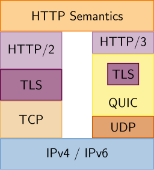

# NGINX Webserver


## Webservers

Wat is een webserver? Zoals de naam zegt is de webserver een programma dat een webpagina of webapplicatie kan hosten.
Een webserver gaat websites van gebruikers serveren, meestal met het Hypertext Transfer Protocol (HTTP) voor met files voor statische sites alss HTML, CSS, afbeeldingen, video,... en ook dynamische
content met PHP, CGI-scripts, etc.

HTTP draait op TCP en gebruikt poort `80`. Het is het standaard protocol in onze webbrowser. Later bekijken we ook HTTPS, HTTP over een TLS connectie op TCP poort `443`, en bied ondersteuning voor HTTP/2 wat connecties kan "multiplexen" voor efficientere gegevensoverdracht.

### HTTP Request

Voor we ingaan op een HTTP server op te zetten gaan we eens zien hoe een typische HTTP request eruit ziet.
We gebruiken het Linux programma `curl` om een HTTP request te maken. cURL laat ons toe vanuit de command like HTTP requests te maken, we gaan ook optie `-v` gebruiken om de verbose logging te zien on zo meer te leren over HTTP.

```bash
curl -v http://simple-http.stuvm.be
```

We krijgen de volgende response van onze server:

```
*   Trying 193.191.186.132:80...
* Connected to simple-http.stuvm.be (193.191.186.132) port 80 (#0)
> GET / HTTP/1.1
> Host: simple-http.stuvm.be
> User-Agent: curl/7.74.0
> Accept: */*
>
* Mark bundle as not supporting multiuse
< HTTP/1.1 200 OK
< Content-Type: text/html
< Date: Sun, 13 Feb 2022 13:41:29 GMT
< Etag: W/"62090a7b-76"
< Last-Modified: Sun, 13 Feb 2022 13:41:15 GMT
< Server: nginx/1.18.0 (Ubuntu)
< Transfer-Encoding: chunked
<
<html>
<head>
  <title>Hello</title>
</head>
<body>
  <h1>Hello World!</h1>
</body>
</html>
* Connection #0 to host simple-http.stuvm.be left intact
```

In het eerste deel zien we dat cURL een TCP connectie gaat maken, hierna zien we onze HTTP **request**. Dit request is wat onze client aan de server gaat vragen `GET / HTTP/1.1` geeft weer dat we een GET request willen doen om data op te halen op het pad `/`. Hieronder vinden we headers terug die meer informatie geven over onze request zoals welke hostname alsook onze user agent.

:::warning note
HTTP werkt vaak met "verbs". Deze verbs geven aan welke actie de server moet uitvoeren.

- `GET` is voor data op te halen
- `POST` is voor data te versturen
- `PUT` is voor data te veranderen
- `DELETE` is voor data te verwijderen
- `HEAD` is voor headers op te halen maar niet de inhoud te tonen

:::

Hierna volgt een response van de server, startend met een HTTP versie en een status code. Deze code geeft weer of het request gelukt is of niet. Gevolgens zijn er headers terug die meer informatie geven over de response net als bij onze request. Op het einde zien we de inhoud van de webpagina!

:::warning note
HTTP Status codes zijn 3 cijfers, het 1ste cijfer geeft het type response aan.
Enkele veel gebruikte codes zijn:

- `200` is een succesvolle response
- `400` is een foutieve request
- `401` is dat authentificatie vereist is
- `404` is een response die aangeeft dat de pagina niet gevonden is
- `500` is een response die aangeeft dat er een server fout is opgetreden
- `418` geeft weer dat we met een [theepot](https://developer.mozilla.org/en-US/docs/Web/HTTP/Status/418) te maken hebben

Een droge lijst om te blokken jammergenoeg... [Ik hoop dat deze katten je dag toch nog leuk kunnen maken.](https://http.cat/)
:::

## NGINX Installatie

Je kan NGINX eenvoudig installeren via de standaard, ingebouwde software repository van Ubuntu!

Vooraleer we dit gaan doen, zorgen we er (bij voorkeur) voor dat we beschikken over de laatste
inhoud in diezelfde software repository:

```bash
sudo apt update.
```

Je mag ook meteen alle geïnstalleerde software upgraden met

```bash
sudo apt upgrade
```

We gaan over tot installeren van NGINX met

```bash
sudo apt install nginx
```

Ubuntu zal meteen de software in de achtergrond opstarten, maar we
gaan dit even controleren.

```
sudo systemctl status nginx
```

Dit commando zou via ‘systemd’-init systeem een status
over deze service moeten teruggeven.
Komt dit min of meer overeen met het onderstaande? Dan heb je je NGINX succesvol geïnstalleerd en gestart!
`systemctl status` geeft ons heel wat informatie over services, daarover meer om het SystemD hoofdstuk.

### Server bekijken

Nu we weten dat onze server draait kunnen we hem eens bekijken. We hebben hierboven cURL gebruikt naar een HTTP server. We testen dut nu op `localhost` het adres dat standaard op je loopback interface staat.

Op de server zelf voeren we het volgende uit:

```bash
curl -v http://localhost
```

We merken dat we een antwoord krijgen met een "Welcome to NGINX" webpagina.

```
$ curl -v http://localhost
*   Trying 127.0.0.1:80...
* TCP_NODELAY set
* Connected to localhost (127.0.0.1) port 80 (#0)
> GET / HTTP/1.1
> Host: localhost
> User-Agent: curl/7.68.0
> Accept: */*
>
* Mark bundle as not supporting multiuse
< HTTP/1.1 200 OK
< Server: nginx/1.18.0 (Ubuntu)
< Date: Sun, 13 Feb 2022 13:39:27 GMT
< Content-Type: text/html
< Content-Length: 612
< Last-Modified: Sun, 13 Feb 2022 13:36:44 GMT
< Connection: keep-alive
< ETag: "6209096c-264"
< Accept-Ranges: bytes
<
<!DOCTYPE html>
<html>
<head>
<title>Welcome to nginx!</title>
<style>
    body {
        width: 35em;
        margin: 0 auto;
        font-family: Tahoma, Verdana, Arial, sans-serif;
    }
</style>
</head>
<body>
<h1>Welcome to nginx!</h1>
<p>If you see this page, the nginx web server is successfully installed and
working. Further configuration is required.</p>

<p>For online documentation and support please refer to
<a href="http://nginx.org/">nginx.org</a>.<br/>
Commercial support is available at
<a href="http://nginx.com/">nginx.com</a>.</p>

<p><em>Thank you for using nginx.</em></p>
</body>
</html>
* Connection #0 to host localhost left intact
```

:::warning note
In kader van deze cursus hebben we voor jou een domeinnaam voorzien onder `r<nummer>.stuvm.be` die we in de cursus gebruiken. Hoe domeinnamen werken zien we in het deel DNS van deze cursus. Voorlopig hebben we dit allemaal voor je voorzien!
:::

Oke allemaal leuk lokaal, maar een webserver is liefst te gebruiken door iedereen!
We openen `r<nummer>.stuvm.be` in je browser en zien dezelfde website.

#### Inhoud aanpassen

Standaard is de inhoud van onze site te vinden in `/var/www/html/`.
We bekijken eventjes wat hier in staat:

```bash
ls /var/www/html/
```

```
index.nginx-debian.html
```

Ubuntu (vanuit Debian) heeft al een kleine webpagina meegegeven. We passen deze even snel aan:

```bash
cd /var/www/html/
sudo rm index.nginx-debian.html
sudo nano index.html
```

Standaard is `index.html` de homepage van je website. We voegen snel even een mini website toe met nano:

```html
<!DOCTYPE html>
<html>
  <head>
    <title>Hello World!</title>
  </head>
  <body>
    <h1>Hello World!</h1>
    <p>Welkom op mijn eigen webserver!</p>
  </body>
</html>
```

Na dit op te slaan en nano af te sluitn geven we ook even de correcte permissies mee. Standaard draait onze webserver onder de user `www-data` en de group `www-data`. We zetten deze permissies op deze bestanden:

```bash
sudo chown www-data:www-data index.html
```

Als je nu opnieuw naar je site gaat krijg je je eigen webpage te zien.

### Processbeheer

We geven ook even een algemeen overzicht mee om het NGINX-proces te beheren in de toekomst.
Probeer dit uit.

- webserver stoppen: sudo systemctl stop nginx
- webserver starten: sudo systemctl start nginx
- webserver herstarten: sudo systemctl restart nginx
- webserver herladen: sudo systemctl reload nginx
- Automatische starten uitschakelen: sudo systemctl disable nginx
- Automatisch starten inschakelen: sudo systemctl enable nginx

## Configuratie NGINX

We gaan in de volgende stappen NGINX configureren, voor we hier mee starten bekijken we eerst welke configuratiebestanden we hebben.

Directories:

- `/etc/nginx/` bevat de configuratiebestanden
- `/var/www/html` de daadwerkelijke webinhoud, die standaard alleen bestaat uit de standaard pagina die je eerder zag. Deze directory kan worden gewijzigd door NGINC-configuratiebestanden te wijzigen.

Files:

- `/etc/nginx/nginx.conf` het belangrijkste configuratiebestand. Dit kan worden gewijzigd om wijzigingen aan te brengen in de algemene NGINX-configuratie. Dit bestand is verantwoordelijk voor het laden van veel van de andere bestanden in de configuratiemap.
- `/etc/nginx/sites-available/` de map waar virtuele hosts per site kunnen worden opgeslagen. NGINX zal de configuratiebestanden in deze map niet gebruiken, tenzij ze aan de `sites-enabled` map zijn gekoppeld.
- `/etc/nginx/sites-enabled/` de map waar ingeschakelde virtuele hosts per site worden opgeslagen. Meestal worden deze gemaakt door te linken naar configuratiebestanden die in de sites-available directory. NGINX leest de configuratiebestanden en links in deze map wanneer het start of laadt opnieuw om een volledige configuratie te compileren.
- `/etc/nginx/modules-available/` en `/etc/apache2/modules-enabled/` deze mappen bevatten respectievelijk de beschikbare en ingeschakelde server uitbreinding modules.

## Logging

Logs zijn essentieel in servers, we bekijken dit nog in detail later in de cursus. Maar we nemen al eens kijkje wat NGINX ons aanbiedt:

- `/var/log/nginx/access.log` standaard wordt elk verzoek op de webserver geregistreerd in dit logbestand, NGINX Apache is
  geconfigureerd om iets anders te doen.

  ```
  10.1.0.11 - - [13/Feb/2022:13:42:26 +0000] "GET / HTTP/1.1" 200 122 "-" "Mozilla/5.0 (compatible; Discordbot/2.0; +https://discordapp.com)"
  10.1.0.11 - - [13/Feb/2022:13:42:29 +0000] "GET / HTTP/1.1" 304 0 "-" "Mozilla/5.0 (X11; Linux x86_64; rv:97.0) Gecko/20100101 Firefox/97.0"
  10.1.0.11 - - [13/Feb/2022:13:42:39 +0000] "GET / HTTP/1.1" 304 0 "-" "Mozilla/5.0 (X11; Linux x86_64; rv:97.0) Gecko/20100101 Firefox/97.0"
  10.1.0.11 - - [13/Feb/2022:13:52:24 +0000] "GET / HTTP/1.1" 200 122 "-" "Mozilla/5.0 (Linux; Android 10; CLT-L29) AppleWebKit/537.36 (KHTML, like Gecko) Chrome/98.0.4758.87 Mobile Safari/537.36"
  ```

- `/var/log/nginx/error.log` standaard worden alle fouten in dit bestand vastgelegd.

## Virtual Hosts met NGINX

Virtualhosts lossen een groot probleem op. Ze maken het mogelijk om meerdere sites op 1 server te hosten. Beter nog op 1 IP adres! Met het tekort aan IPv4-adressen kunnen we dit al maar goed gebruiken!

Hoe werken ze? Hierboven zagen we een HTTP request.

```
GET / HTTP/1.1
Host: simple-http.stuvm.be
```

Onze browser gaat de hostname meesturen met alle requests, op basis van dit kan onze server beslissen welke website weer te geven!
Dit fenomeen heet "virtual hosting".

We vinden al onze virtual hosts in `/etc/nginx/sites-available/` en `/etc/nginx/sites-enabled/`.

We bekijken `/etc/nginx/sites-available/`

```bash
ls /etc/nginx/sites-available/
```

We zien de volgende output:

```
$ ls /etc/nginx/sites-available/
default
```

Momenteel zien we enkel de default virtual host. We gaan er zelf een toevoegen.

```bash
sudo nano /etc/nginx/sites-available/site-twee
```

We voegen de volgende conguratie toe:

```
server {
	listen 80; # server op poort 80
	listen [::]:80; # server op IPv6-poort 80

	root /var/www/site-twee; # map van de website

	index index.html index.htm; # welke files je index zijn

	server_name site-twee.rnummer.stuvm.be; # hostname van de site, PAS DEZE AAN

	location / {
		try_files $uri $uri/ =404; # geef een 404 error als de pagina niet bestaat
	}
}
```

De NGINX configuratie werkt met blokken aangeven tussen `{}`. Deze blokken bevatten regels die worden steeds afgesloten met een `;`.
We stellen hierin onze `site-twee.r<nummer>.stuvm.be` site in om content uit de map `/var/www/site-twee` te halen.

Voor we de configuratie inladen moeten we de site map nog aanmaken!

```bash
sudo mkdir /var/www/site-twee
```

We voegen ook meteen een index.html aan deze map toe.

```bash
sudo nano /var/www/site-twee/index.html
```

```html
<!DOCTYPE html>
<html>
  <head>
    <title>Site Twee</title>
  </head>
  <body>
    <h1>Site Twee</h1>
    <p>Dit is mijn tweede website</p>
  </body>
</html>
```

We zetten nog even de permissies op deze map.

```bash
sudo chown -R www-data:www-data /var/www/site-twee
```

Onze tweede site staat nu klaar maar is nog niet actief. We moeten deze site nu activeren.
Dit doen we door een **symbolic link** naar de configuratie te maken.

```bash
sudo ln -s /etc/nginx/sites-available/site-twee /etc/nginx/sites-enabled/site-twee
```

Nu alles klaar staat testen we eerst onze configuratie.

```bash
sudo nginx -t
```

Als je het volgende ziet is alles gelukt!

```
nginx: the configuration file /etc/nginx/nginx.conf syntax is ok
nginx: configuration file /etc/nginx/nginx.conf test is successful
```

We kunnen nu NGINX vragen deze configuratie in te laden:

```bash
sudo systemctl reload nginx
```

Surf nu naar `site-twee.r<nummer>.stuvm.be` en je krijgt normaal de inhoud van je tweede website te zien.

## Next generation: Caddy

[Caddy](https://caddyserver.com/) is een recente open source webserver die toch al heel wat marktaandeel begint te krijgen. Caddy is niet geschreven in C zoals Apache en NGINX maar in Go. Go is een snelle maar toch memory-safe progameertaal. Dit maakt Caddy al veiliger terwijl goede perfomantie te hebbben.

Caddy wint populariteit door het feit dat essentiele functies al ingebouwd zijn. Zo kan Caddy zelfstandig HTTPS Certificaten aanvragen. Caddy ondersteund ook als een van de eerste HTTP/2 en HTTP/3 en heeft Caddy een simpele configuratie syntax.

Caddy heeft op dit moment een marktaandeel van 0.1%.

## Next generation: HTTP/3

HTTP/3 komt voort uit het QUIC protocol van Google, net zoals HTTP/2 gebaseerd was op Google's SPDY.
HTTP/3 kent het grootste verschil in het feit dat het geen TCP gebruikt maar UDP met daarop QUIC als modern alternatief voor alle functies die TCP normaal voor zijn rekening neemt, dit maakt verbindingen sneller.

Momenteel ondersteunt 73% van de browsers HTTP/3[^http3browser] en 25% van alle servers HTTP/3[^http3server]. NGINX ondersteund sinds 2020 een beta implementatie voor HTTP/3.



[^http3browser]: cijfers van [caniuse.com](https://caniuse.com/http3)
[^http3server]: cijfers van [w3techs.com](https://w3techs.com/technologies/details/ce-http3)
