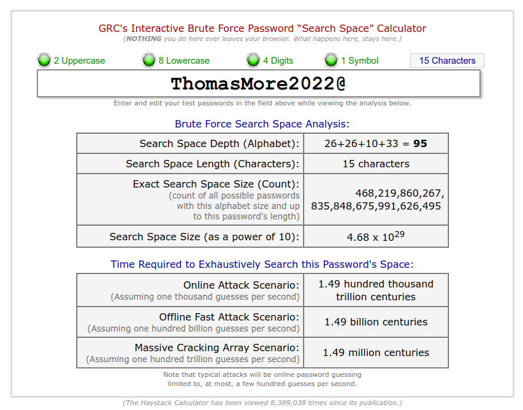

# Passwords

Wachtoorden zijn overal gebruikt in deze wereld. Maar als we aan onze servers gaan denken moeten we gaan oppassen met wachtwoorden.
Wachtwoorden zijn makkelijk te achterhalen in veel te veel gevallen.

## Hoe lang tot we je wachtwoord kunnen raden?

We bekijken even [password haystacks](https://www.grc.com/%5Chaystack.htm). Dit gaat bereken hoelang **1 computer** erover gaat doen om je wachtwoord te brute forcen en houd geen rekening met lijsten van gelekte passwoorden of woordeboeken!

## Ben jij te koop op het dark web?

Voor enkele euros kan je op de donkere plekken op het internet een lijst aan wachtwoorden kopen die komt van slecht beveiligde websites. Al geluk hebben we ook echte data verzamelaars die deze voor goed gebruiken.

[Have I been pwned?](https://haveibeenpwned.com/) heeft een collectie bijgehouden door security researcher Troy Hunt. Dit is ondertussen een bekende database die ook door andere diensten wordt gebruikt voor alerts.

_Prijzen niet na te vragen bij uw docent_

## Tips

- Zorg ervoor dat je een veilig wachtwoord kiest.
- Limiteer het aantal pogingen met tools als [Fail2Ban](https://www.fail2ban.org/)
- Genereer willekeurige wachtwoorden
- Prefereer geen wachtwoorden, werk bijvoorbeel met [SSH Keys](/security/ssh-keys)
