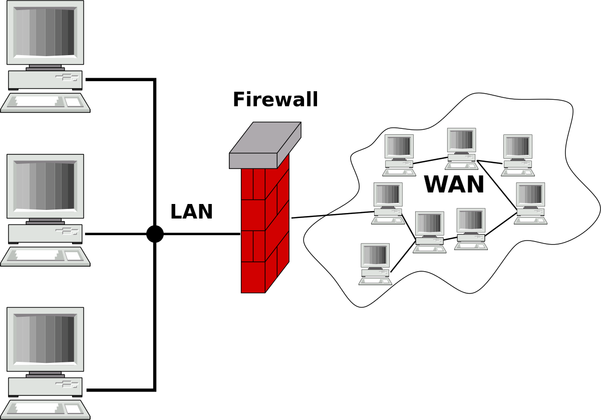
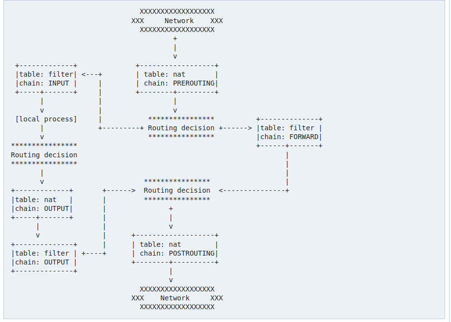

# Uncomplicated Firewall

Als we over security praten kunnen we moeilijk een firewall uit het verhaal weglaten. Onze firewall gaat ons bescherming bieden tussen twee netwerken. We hebben er allemaal een thuis in de vorm van onze NAT-router.



We kunnen eigenlijk (kort door de bocht) spreken over 2 types firewall:

- Een netwerk firewall: meestal fysiek tussen de LAN en WAN.
- Een systeem firewall: deze staat op een PC of server

Wij spreken in deze cursus over het laatste. We willen ongevraagd netwerkverkeer naar/van onze server kunnen afschermen.
Er zijn een aantal beschikbare applicaties om firewalls in Ubuntu te beweren, maar enige complexiteit blijkt aanwezig te zijn.
Linux zelf heeft een ingebouwde filter: "iptables". iptables is de core van de netwerk stack op onze Linux server. Deze beheert alle routing van netwerkverkeer. In recente versies van Debian en Ubuntu is de iptables netfilter vervangen door "nftables".

iptables kent verschillende routing fases en tabellen waar je regels kan op instellen. De [Arch Linux wiki](https://wiki.archlinux.org/title/iptables) bevat een overzicht van deze tabellen.



iptables is standaard ook stateless, een reboot reset alle regels die ingesteld zijn.
Samen met een complexe command line interface is het enorm moeilijk om iptables correct te configureren.

Daarom bekijken we in deze cursus liever een veel gebruikte tool die al het harde werk voor ons doet!

## Uncomplicated Firewall

Eén van de meest gebruikte host-based firewalls in Ubuntu is de Uncomplicated Firewall (UFW) vanwege zijn krachtige functionaliteit en eenvoudige gebruiksvriendelijkheid. UFW was toegevoegd in Ubuntu 8.04 als een firewall interface bovenop iptables.

:::warning note
We bekijken in deze cursus IPv4 firewall regels, de syntax voor IPv6 is gelijkaardig.
:::

### Installatie

We installeren UFW via `apt`:

```bash
sudo apt update
sudo apt install ufw
```

We bekijken nu of UFW actief is:

```bash
sudo systemctl status ufw
```

We krijgen nu normaal dat onze service "active" is van systemd.

```
$ sudo systemctl status ufw
● ufw.service - Uncomplicated firewall
     Loaded: loaded (/lib/systemd/system/ufw.service; enabled; vendor preset: enabled)
     Active: active (exited) since Tue 2022-02-15 12:54:57 CET; 28min ago
       Docs: man:ufw(8)
   Main PID: 760 (code=exited, status=0/SUCCESS)
      Tasks: 0 (limit: 38094)
     Memory: 0B
        CPU: 0
     CGroup: /system.slice/ufw.service
```

We zijn nu klaar om de firewall te configureren!

### Configuratie

Configuratie gaan we vooral via de commandline zelf doen, maar we moeten 1 value dubbelchecken.
UFW heeft default congiguratie voor eerste gebruik gedefinieerd in `/etc/default/ufw`.

```bash
sudo nano /etc/default/ufw
```

De default configuratie is goed voor ons maar we willen 1 value checken:

```
IPV6=yes
```

We hebben geen IPv6 op onze servers maar we willen dat er wel een IPv6 firewall is. Dit is fundamenteel omdat anders onze firewall rond gewerkt kan worden vanaf het moment dat we IPv6 ondersteunen en zo dus onverwacht onze firewall effectief hebben uitgezet. Dit willen we dus vermijden.

#### Default policies

Voor we onze firewall gaan activeren willen we de "default policies" instellen. Deze policies zijn de standaard waarden voor ons verkeer waarvoor geen specifieke regels voor geschreven zijn.
We willen 2 dingen doen:

- weigeren van alle inkomende verbindingen
  - zo vermijden we connecties naar server applicaties die we niet willen openstellen
- toelaten van alle uitgaande verbindingen.
  - zo laten we toe dat onze software nog wel aan het internet kan

```bash
sudo ufw default deny incoming
sudo ufw default allow outgoing
```

#### Instellen regels

Firewall regels kunnen we doen via de commandline met het `ufw` commando. De syntax is vrij simpel en heel flexibel.

Als we een service willen toelaten kunnen we bijvoorbeeld de naam gebruiken:

```bash
sudo ufw allow ssh
```

UFW gaat `ssh` toestaan van alle IPs naar alle IPs op je server, UFW weet door `/etc/services` dat dit een SSH service op TCP poort 22 is.

We kunnen dit ook schrijven als

```bash
sudo ufw allow 22
```

Dit werkt voor 1 poort, we kunnen ook meteen een range toestaan met een `:`. Bjvoorbeeld

```bash
sudo ufw allow 6000:6007
```

We kunnen ook limiteren tot TCP of UDP:

```bash
sudo ufw allow 22/tcp
sudo ufw allow 53/udp
```

Bovenstaande regels zijn het meeste gebruikt, zij laten verkeer op een poort toe van elk IP adres.
We kunnen ook dat gaan limiteten:

```bash
sudo ufw allow from 193.191.186.132 to any port 22
```

Het deel `from` zegt welk bron IP toegestaan is. Het deel `to` geeft aaan naar welk IP (in dit geval `any` van onze interfaces) en poort `22`.

We kunnen ook een subnet toestaan:

```bash
sudo ufw allow from 10.2.0.0/16 to any port 22
```

Hetzelfde is omgekeerd mogelijk, stel dat we een bepaald IP address willen bannen kunnen we dit schrijven:

```bash
sudo ufw deny from 192.168.20.1
```

#### Eerste configuratie

Nu we weten hoe de UFW syntax werkt kunnen we de firewall configureren.
**Voor** we onze firewall gaan aanzetten moeten we zorgen dat we zelf nog kunnen inloggen. We gaan dus eerst de SSH service toestaan.
Ook stellen we in dat HTTP en HTTPs openstaan voor de wereld.

Als laatse stap zetten we de firewall op actief met `ufw enable`:

```bash
sudo ufw default deny incoming
sudo ufw default allow outgoing

sudo ufw allow ssh
sudo ufw allow http
sudo ufw allow https
sudo ufw enable
```

(`ufw disable` zet onze firewall uit, niet aangeraden gewoon ter informatie)

We bekijken nu de status met

```bash
sudo ufw status
```

We zien dat onze firewall op active staat en we krijgen ook een lijst van al onze firewall regels.

```
$ sudo ufw status
Status: active

To                         Action      From
--                         ------      ----
22/tcp                     ALLOW       Anywhere
80/tcp                     ALLOW       Anywhere
443                        ALLOW       Anywhere
22/tcp (v6)                ALLOW       Anywhere (v6)
80/tcp (v6)                ALLOW       Anywhere (v6)
443 (v6)                   ALLOW       Anywhere (v6)
```

#### Aanpassen Firewall

Willen we een regel aanpassen dan moeten we deze verwijderen met `ufw delete` en terug aanmaken.
Deleten kunnen we op twee manieren:

```bash
sudo ufw status numbered
```

```
$ sudo ufw status numbered
Status: active

     To                         Action      From
     --                         ------      ----
[ 1] 22/tcp                     ALLOW IN    Anywhere
[ 2] 80/tcp                     ALLOW IN    Anywhere
[ 3] 443                        ALLOW IN    Anywhere
[ 4] 22/tcp (v6)                ALLOW IN    Anywhere (v6)
[ 5] 80/tcp (v6)                ALLOW IN    Anywhere (v6)
[ 6] 443 (v6)                   ALLOW IN    Anywhere (v6)
```

Dit geeft ons alle regels met nummers. We kunnen nu een bepaalde regel weghalen door bijvorbeeld:

```bash
sudo ufw delete 6
```

We kunnen ook een regel verwijderen door de regel te herhalen maar daarvoor `ufw delete` te zetten.
Bijvoorbeeld:

```bash
sudo ufw delete allow https
```
