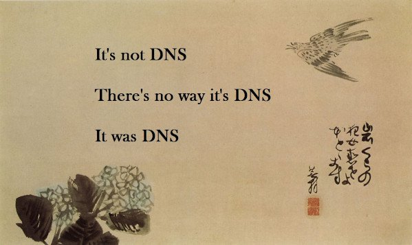
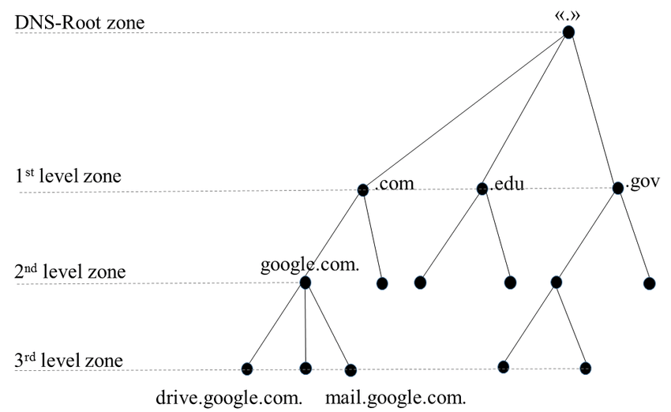
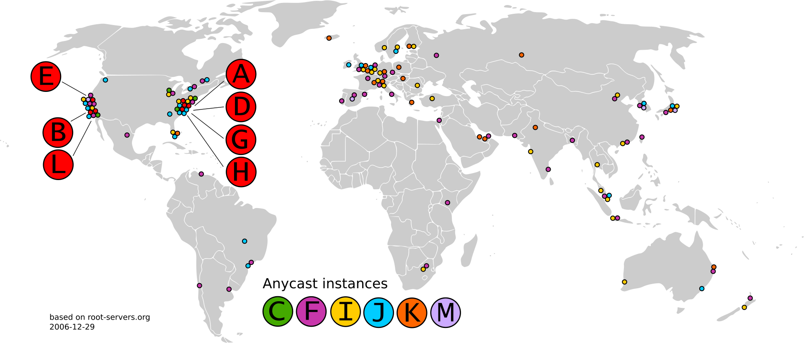
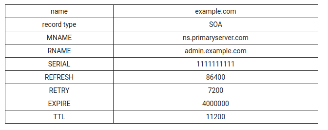
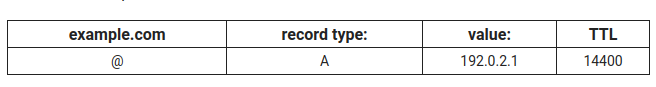
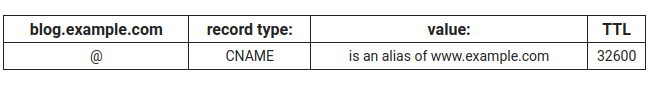
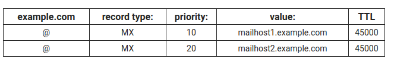
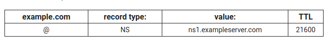
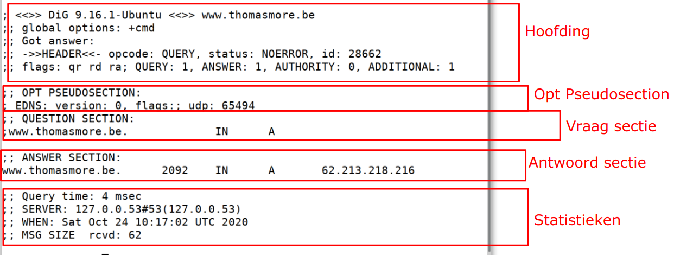

# DNS - Domain Name System



> Everything is a freaking DNS problem

Dit is een vaak voorkomende uitdrukking uit de SysAdmin wereld, omdat er veel problemen uit voorkomen uit het slecht beheren van DNS. Alle systemen zijn er afhandelijk van dat maakt dat een DNS probleem vaak alles met zich meeneemt.

## DNS

Heyt Domain Name System (DNS) is een de om een naam te geven aan apparaten op een netwerk.
Het vertaalt een leesbare naam naar een IP adres (dat toch niemand kan onthouden).
DNS is misschien wel het belangrijk onderdeel van het internet!

Het hiërarchisch systeem dat ervoor zorgt ervoor dat mensen geen "moeilijke" websites moeten onthouden:
zo kan je in plaats van 172.217.20.67 in te typen beter google.be gebruiken.
"google.be" noemen we een een domein naam.



### Top-Level Domain (TLD)

Het meest algemene deel van de domein naam, het is het deel dat het meest rechts staat.
Voorbeelden:

- be
- nl
- fr

Deze TLDs zijn gelinkt aan de landen. Ze worden ook wel eens ccTLD - Country Code Top-Level Domain genoemd.

Je hebt ook algemene TLDs, Generic TLDs of gTLD.
Voorbeelden:

- com
- org
- net

Deze zijn de klassieke gTLDs. De recente groei van het internet heeft ook met zich mee gebracht dat er vraag was aan heel wat nieuwe TLDs als:

- jobs
- biz
- info
- name
- pro
- ninja
- club
- pizza

Of steden met eigen TLDs:

- ghent
- brussels
- vegas
- paris

Sommigen noemen het wel eens een wildgroei maar het geeft wel meer mogelijkheden, [Wikipedia heeft een complete lijst van TLDs](https://en.wikipedia.org/wiki/List_of_Internet_top-level_domains). Elke TLD is in beheer van een bepaalde organisatie die de authoritive nameservers hiervoor host, gesponsord met het "registatie bedrag" dat je betaald om een domein naam te kopen

- com
- be
- net
  • Staan bovenaan de hiërarchie
  • Geven andere domein namen uit, binnen hun TLD

### Root Domain

`www.google.be` is technisch gezien geen volledige DNS invoer! Er komt een verborgen punt achter de TLD, dus `www.google.be.`
Deze punt wordt het root domein genoemd, deze worden verstrekt door de root name servers.
Er zijn er 13 in de wereld, ze hebben elks een letter: A tot M.
Als deze verdwijnen, is er geen internet meer zoals we het kennen! Daarom zijn de verspreid over de wereld en maken ze allemaal deel uit van andere organisaties.
1 "server" voor een root server is vandaag niet het geval meer, ook staan ze niet meer op 1 locatie. Ze maken allemaal gebruik van [anycast IPs](https://en.wikipedia.org/wiki/Anycast) om requests te load balancen en redundantie te krijgen.



Root servers zijn hardcoded in onze DNS setup op onze PCs als ook DNS resolver servers.

### Host

Een host is een individuele computer binnen een domein. Bijvoorbeeld, je webserver bevindt zich op de 'www' host.
Dan krijg je `www.google.be` .
Je kan meerdere individuele hosts hebben, zoals:

- db.google.be - voor database toegang
- api.google.be - voor de programmeer API
- ftp.google.be - voor FTP toegang tot het domein
  De host naam kan alles zijn wat je wil, zolang als het uniek is voor het domein!

### Subdomain

Subdomain is niet te verwarren met een `host`. DNS is een hiërarchie: een TLD heeft vele domeinen onder zich zo `.be.` heeft
`thomasmore.be` en `google.be`.

Een subdomein verwijst naar elk domein dat onderdeel is van een groter domein.
Bijvoorbeeld thomasmore.be en google.be zijn dus subdomeinen van het .be domein.

Elk domein kan subdomeinen hebben zo kan de school kan bijvoorbeeld een subdomein hebben voor het IT team, waarvan:

- it.thomasmore.be
- aanmelden.it.thomasmore.be - specifieke host onder het domein `it.thomasmore.be`

Het verschil tussen een host en een subdomein is dat een host een enkele computer of resource aanduidt, terwijl een subdomein het domein nog eens helemaal gaat onderverdelen.

### Nameserver

Een nameserver is een server die domein namen vertaalt naar een IP adres.
Zij doen het al zware werk in DNS, ze antwoorden op DNS queries die van verschillende gebruikers gestuurd worden. Vaak ook gestuurd door andere DNS servers.

Een nameserver kan 'gezaghebbend' (authoritative) zijn, zij kunnen "het correcte" antwoord geven op een vraag, een DNS server kan authoritive zijn voor een bepaalde domein naam. DNS servers die we zelf opzetten gaan dus authoritive zijn voor domeinnamen in ons bezig.

Als ze niet gezaghebbend zijn op een bepaalde vraag, verwijzen ze vaak door naar andere server, of geven het antwoord in hun cache. DNS servers als 1.1.1.1 en 8.8.8.8 zijn nooit authoritive maat hebben een grote cache voor te kunne antwoorden.

### Zone file

Simpel tekst bestand voor DNS records te configureren.
De zone file bevat de vertaling van domein naam naar IP adres.
Deze worden pgeslagen op een nameserver en definieert de resources die beschikbaar zijn (authoritive) of wijst naar andere NS waar deze info te vinden is.

Een enkele lijn binnen een zone bestand is een `record`.
Een record kan:

- De toewijzing van domein naam naar IP adres weergeven
- Een domein verwijzen naar een andere domein
- Name servers definiëren
- Mail servers definiëren
- etc.

## Record types

### Start of Authority (SOA)

Start of Authority (SOA) is een verplicht in een zone bestand.
Het slaat belangrijke informatie op over een domein of zone, zoals het e-mailadres van de beheerder, wanneer het domein voor het laatst is bijgewerkt, en hoe lang de server moet wachten tussen refreshen van data.



### A en AAAA record

Toewijzing van een domein naar een IP adres. A record is voor IPv4, een AAAA record is voor IPv6 (een v6 is 4x zo lang als een v4 vandaar 4xA).



Een `@` in DNS betekend de root van de zone, dus bijvoorbeeld `@` in de configuratie van Thomas More is `thomasmore.be`

### Canonical name (CNAME) record

Verwijzing naar een ander record, de waarde is dus een andere domein naam.

Meestal kost een extra aanvraag naar de DNS server. Vaak is het performanter om een extra A (of AAAA) record te gebruiken.
Is het toch nodig dan gaan vele geavanceerde DNS servers zelf een antwoord meesturen voor de record waar de CNAME naar wijst uit een eigen cache.



CNAME records zijn enkel toegelaten op subdomeinen van je eigen domein!

### Mail exchange (MX) record

Geeft aan welke mail server er gebruikt wordt voor dit domein.
Een MX record moet naar een A of AAAA record wijzen
MX recorfs hebben ook een priority nummer dat wijst op voorkeur van behandeling. Een lager nummer heeft voorkeur. Je kan dit gebruiken voor een backup mailserver in te stellen.



## Name server (NS)

NS staat voor 'nameserver' en het nameserverrecord geeft aan welke DNS-server gezaghebbend is voor dat domein.
NS-records vertellen het internet waar het IP-adres van een domein te vinden is.
Een domein heeft vaak meerdere NS-records die primaire en secundaire nameservers voor dat domein kunnen aangeven dit voor redundantie.

Onze authotivie server voor een TLD gaat enkel maar NS records teruggeven.



### Pointer record (PTR)

Toewijzing van een domein naam aan een IP adres, het is het omgekeerde van een A (of AAAA) record.
Het eindigt altijd op '.in-addr.arpa.' voor IPv4 of '.ip6.arpa.' voor IPv6.
Configuratie van deze loopt meestal via je internet service provider.

## DNS vs. DNS

Vaak spreken we over de DNS server instellen als we een netwerk adapter gaan instellen. We mogen deze DNS server niet gaan verwarren met onze authoritive DNS server.

Een DNS Resolver is een server erver die voor ons de hele DNS “zoektocht” maakt.
Voorbeelden zijn

- kan zelf hosted zijn, niet super perfomant want weinig cache. Kan leuk zijn met extra functies als de [pi-hole](https://pi-hole.net/)
- onze ISP (Telenet,Proximus,Belnet,...) - heeft vaak een grote cache en is "dichtbij" onze server
- 1.1.1.1 (Cloudflare) 8.8.8.8 (Google) 9.9.9.9 (IBM), OpenDNS, NextDNS... - zijn Anycast en veel gebruikt

Authoritive DNS, de DNS server die onze domein gaan hosten:

- Zelf hosted (zie oefening met Bind9)
- Cloud hosted: DNSimple, Cloudflare, Amazon Route53, Google Cloud DNS,...

:::warning bloktip
De website [howdns.works](https://howdns.works/) is een leuke maar ook correcte uitleg van DNS!
:::

## Dig


Dig is een enorm handige tool voor DNS records op te zoeken, te testen en te troubleshooten!

### Installatie

We installeren dig met APT:

```bash
sudo apt update
sudo apt install dnsutils
```

### Simpele vraag

Simpele vraag naar het IP adres van `discord.thomasmore.be`
`+short` zorgt voor beperkte informatie.

```bash
dig discord.thomasmore.be +short
```

```
$ dig discord.thomasmore.be +short
5.134.6.217
```

`discord.thomasmore.be` heeft enkel een A-record met dan IP.

We bekijken nu de cursus zelf: `linux.maartje.dev`

```bash
dig linux.maartje.dev +short
```

```
$ dig linux.maartje.dev +short
dynaproxy.ari.maartje.dev.
51.15.107.76
```

Deze domein naam heeft een CNAME naar `dynaproxy.ari.maartje.dev.` met het IP `51.15.107.76`.

Zonder `+short` krijgen we al deze informatie.

```bash
dig linux.maartje.dev
```

```
$ dig linux.maartje.dev +short
; <<>> DiG 9.16.15-Ubuntu <<>> linux.maartje.dev
;; global options: +cmd
;; Got answer:
;; ->>HEADER<<- opcode: QUERY, status: NOERROR, id: 44803
;; flags: qr rd ra; QUERY: 1, ANSWER: 2, AUTHORITY: 0, ADDITIONAL: 1

;; OPT PSEUDOSECTION:
; EDNS: version: 0, flags:; udp: 65494
;; QUESTION SECTION:
;linux.maartje.dev.		IN	A

;; ANSWER SECTION:
linux.maartje.dev.	54	IN	CNAME	dynaproxy.ari.maartje.dev.
dynaproxy.ari.maartje.dev. 54	IN	A	51.15.107.76

;; Query time: 3 msec
;; SERVER: 127.0.0.53#53(127.0.0.53)
;; WHEN: Sun Mar 13 13:06:58 CET 2022
;; MSG SIZE  rcvd: 90
```

We zien hier verschillende delen:



In het answer section zien we ook een aantal delen:

```
;; ANSWER SECTION:
linux.maartje.dev.	54	IN	CNAME	dynaproxy.ari.maartje.dev.
dynaproxy.ari.maartje.dev. 54	IN	A	51.15.107.76
```

- `linux.maartje.dev.` is de record naam
- `54` is het aantal seconden dat we dit mogen cachen = Time To Live (TTL)
- `IN` is een internet record
- `CNAME` is het record type
- `dynaproxy.ari.maartje.dev.` is de record waarde

We kunnen ook en bepaald record type opvragen, zoals MX

```bash
dig thomasmore.be MX
```

```
$ dig thomasmore.be MX
; <<>> DiG 9.16.15-Ubuntu <<>> thomasmore.be MX
;; global options: +cmd
;; Got answer:
;; ->>HEADER<<- opcode: QUERY, status: NOERROR, id: 45049
;; flags: qr rd ra; QUERY: 1, ANSWER: 1, AUTHORITY: 3, ADDITIONAL: 2

;; OPT PSEUDOSECTION:
; EDNS: version: 0, flags:; udp: 65494
;; QUESTION SECTION:
;thomasmore.be.			IN	MX

;; ANSWER SECTION:
thomasmore.be.		3589	IN	MX	0 thomasmore-be.mail.protection.outlook.com.
```

### @ resolver

We kunnen ook met dig aan elke DNS resolver een vraag gaan stellen, dit doen we met `@`

Bijvoorbeeld gaan we 8.8.8.8 vragen voor een IP

```bash
dig thomasmore.be @8.8.8.8
```

```
$ dig thomasmore.be @8.8.8.8
; <<>> DiG 9.16.15-Ubuntu <<>> thomasmore.be @8.8.8.8
;; global options: +cmd
;; Got answer:
;; ->>HEADER<<- opcode: QUERY, status: NOERROR, id: 14798
;; flags: qr rd ra; QUERY: 1, ANSWER: 1, AUTHORITY: 0, ADDITIONAL: 1

;; OPT PSEUDOSECTION:
; EDNS: version: 0, flags:; udp: 512
;; QUESTION SECTION:
;thomasmore.be.			IN	A

;; ANSWER SECTION:
thomasmore.be.		3600	IN	A	62.213.218.216

;; Query time: 43 msec
;; SERVER: 8.8.8.8#53(8.8.8.8)
;; WHEN: Sun Mar 13 15:13:56 CET 2022
;; MSG SIZE  rcvd: 58
```

We vergelijken even de antwoorden van verschillende DNS resolvers

```bash
dig +short www.rt.com @193.190.198.2 #Belnet, werkt enkel op school
dig +short www.rt.com @1.1.1.1 #Cloudflare
```

```
$ dig +short www.rt.com @193.190.198.2
193.191.245.56
$ dig +short www.rt.com @1.1.1.1
en.wpc.rt.com.
185.178.208.121
```

:::warning note
Op het moment van schrijven blokeert de Belgische overheid Rusische media op DNS niveau. Zoals je kan zien is omzeilen enorm makkelijk.
:::

### +trace

Met de `+trace` optie kan je een DNS resolutie helemaal bekijken, dig gaat starten bij de rootservers en alle stappen uitvoeren. Zo kan je uitvinden wat er misloopt bij het instellen van je DNS.

```bash
dig thomasmore.be +trace
```

```
$ dig thomasmore.be +trace

; <<>> DiG 9.16.15-Ubuntu <<>> thomasmore.be +trace
;; global options: +cmd
.			208576	IN	NS	a.root-servers.net.
.			208576	IN	NS	b.root-servers.net.
.			208576	IN	NS	c.root-servers.net.
.			208576	IN	NS	d.root-servers.net.
.			208576	IN	NS	e.root-servers.net.
.			208576	IN	NS	f.root-servers.net.
.			208576	IN	NS	g.root-servers.net.
.			208576	IN	NS	h.root-servers.net.
.			208576	IN	NS	i.root-servers.net.
.			208576	IN	NS	j.root-servers.net.
.			208576	IN	NS	k.root-servers.net.
.			208576	IN	NS	l.root-servers.net.
.			208576	IN	NS	m.root-servers.net.
;; Received 503 bytes from 127.0.0.53#53(127.0.0.53) in 39 ms

be.			172800	IN	NS	d.nsset.be.
be.			172800	IN	NS	c.nsset.be.
be.			172800	IN	NS	y.nsset.be.
be.			172800	IN	NS	b.nsset.be.
be.			172800	IN	NS	z.nsset.be.
be.			172800	IN	NS	a.nsset.be.
be.			86400	IN	DS	12664 8 2 75141E9B1188A95A7A855BF47E278A742A5E3F2DDEED8E995D749D48 F2F0E72D
be.			86400	IN	DS	52756 8 2 5485AC33DD7C7ED237EA2A4BD269731C816960FE181042024484B5CE CA6ECC9F
be.			86400	IN	RRSIG	DS 8 1 86400 20220326050000 20220313040000 9799 . MyvomweWG6YNFHwZKZkuzLJ6XUHohEDnW1/ouxeNCagP8oWXXuPgfEO5 ps7VZZAg6TZbQyKaPeWrh2Dd9jdui2i3yESeTYl8y1OdHzZTHTROdba2 c32zrUh+mfD107naBvMusUcMDy1BRxSc/xNQO+9v9deUtoGwnitjuW3O qPbFc7FYNzcwxCFXMtR2sSy8o3nChoX4ShQRg/H8JyzFeJ6MMH3rjZpy 24+aXVJ8islEs3T4LwcqF6KwiFeMtcYkaF89ENMEiRqY2jkN4VH7woTe CaoUtpdjGxmV6TzCUp4capXh55hWD7Xo3XJyPSE+6elx51r/O1Wx+3th W9KtBw==
;; Received 791 bytes from 192.58.128.30#53(j.root-servers.net) in 31 ms

thomasmore.be.		86400	IN	NS	ns2.belnet.be.
thomasmore.be.		86400	IN	NS	ns3.belnet.be.
thomasmore.be.		86400	IN	NS	ns1.belnet.be.
ba141snrnoe1rc9mddgrest23g657rir.be. 600 IN NSEC3 1 1 5 1A4E9B6C BA175A6M75ITNTD2DO5RIQLCVM45GSMR NS SOA RRSIG DNSKEY NSEC3PARAM
ba141snrnoe1rc9mddgrest23g657rir.be. 600 IN RRSIG NSEC3 8 2 600 20220331223823 20220309100036 7359 be. j9Yyu7tUHu+BwRrnqdM0/kyQxs75g+mZHRfQsMaIqMLVUmn+EJbSjO2f BupTuWH9Pm0900c5d5ynXroEjSkWJocKkPKuHyM2xUajCAcUpgf9eGkz 0s6ioryjMuWZVVLS4FT2XIDmK0JhY2Y/9teO6i6yn14dyYNZI9yNquLD 2ek=
nn9pn59ki9m1be2ssp48ld67g7ceec0c.be. 600 IN NSEC3 1 1 5 1A4E9B6C NN9TH6B4VGI5NDLQLA5RSKMT58B7AQD2 NS DS RRSIG
nn9pn59ki9m1be2ssp48ld67g7ceec0c.be. 600 IN RRSIG NSEC3 8 2 600 20220330001255 20220307223002 7359 be. cMu3SJOcNd+ncc7VkGTKHqusdoRsiQwmYdgHxyiSE65djVdvUFUGhu59 00XGoW7VRPZWXvawP6oTAcwmNCyXENzUxC0qpz4Jc+m+cwxlop2fKBeC wTo038m7RgjVHxgOB06+uElt0NV93z6n/X9D0fb2fKDdXuwfdI2oN6ys VZk=
;; Received 726 bytes from 194.0.6.1#53(a.nsset.be) in 23 ms

thomasmore.be.		3600	IN	A	62.213.218.216
thomasmore.be.		3600	IN	NS	ns.thomasmore.be.
thomasmore.be.		3600	IN	NS	ns1.belnet.be.
thomasmore.be.		3600	IN	NS	ns2.belnet.be.
;; Received 134 bytes from 193.190.182.40#53(ns2.belnet.be) in 31 ms

```

## DNS Server

> In de cursus bekijken we Bind9 als DNS server. We zien dit in de vorm van een begeleidende oefening, deze is te vinden op Canvas.
