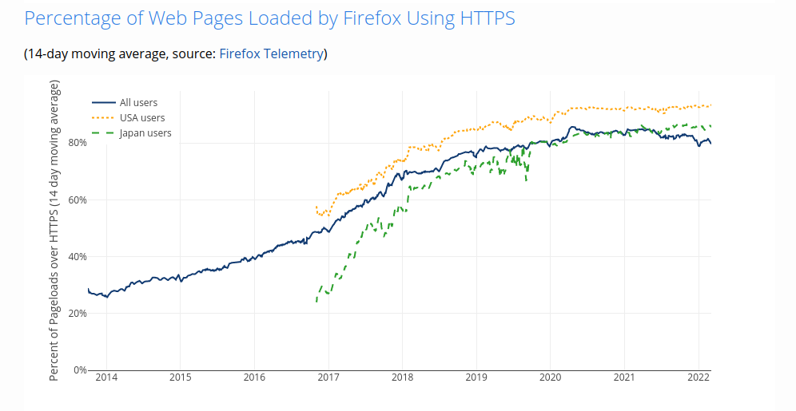
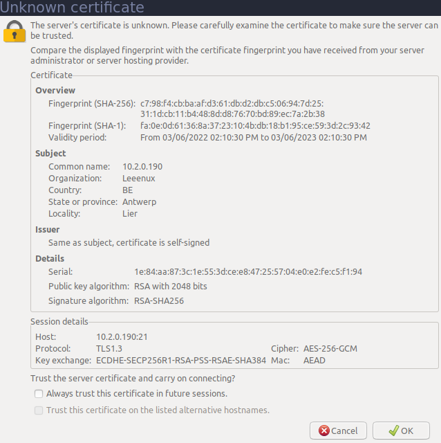
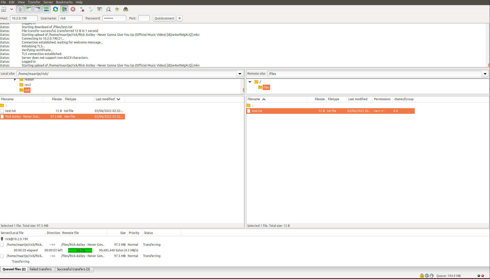

# FTP

FTP staat voor het File Transfer Protocol. FTP is al ontworpen in 1971 (wetenden dat IP in development was sinds 1974 en IPv4 pas in 1978 bescherven werd), maar werd aangepast rond 1980 voor gebruik met TCP en IP. Het doel van FTP was zeer simpel: uitwisselen van bestanden over het internet, kijkende naar de tijd gaat het dan vooral over academici die papers publiceren en willen lezen. De dag van vandaag is FTP nog in gebruik maar het originele doel is dan weer vervangen door het (betere) HTTP(S) protocol.

Waarom willen we in 2022 dan nog FTP gebruiken? De zogeheete "anonymous FTP" waar iedereen files kon downloaden van een server is bijna uitgestorven. Maar FTP is bidirectioneel en heeft mogelijkheden tot het aanmelden van gebruikers. Daardoor zien we FTP vandaag nog op veel plekken zoals op een NAS (naast NFS en SMB) voor bestanden op te slaan, of backups te maken.
Wij kijken vooral ook nog naar het gebruik in werbhosting, het blijft een populaire methode om websites te uploaden van je laptop naar je server.

FTP kent zijn roots in de 1970s... Daarom merken we op da het een enorm complex in de normen van vandaag.
Het kent verschillende transactie modusen en file encodatie transport modusen. Het opent en sluit 1 poort per transactie, wat toen een goed idee leek om verschillende connecties tegelijk te aanvaarden. FTP heeft het niet met NAT, al is dat dankzij aanpassingen in NAT routers wel voor een groot deel opgelost nu, zij volgen namelijk de verbinding op en zetten zo nodige poorten open. SFTP en FTPS lossen een deel van deze problemen op.

## (S)FTP(S)?

Wij gaan in deze cursus geen FTP server opzetten, FTP zelf is onveilig. We gaan kijken naar twee protocollen gebouwd op FTP: SFTP en FTPS.
Waarom geen FTP? Het internet is niet meer de brave plek voor academici/technologists die het lang geweest is. We zitten in een wereld waar elke vulnerability binnen enkele dagen wordt misbruikt. Nog maar te zwijgen over de ontdekkingen door Edward Snowden over NSA, en al de rest die masaal internet verkeer wil afluisteren... Sinds de internet documenten van de NSA gelekt werden zien we een heel ander internet voor ons, voorheen werd encryptie enkel gebruikt voor het versturen van logingegevens, waarna het weer werd uitgezet. Vele sites vonden het overbodig.
Sinds 2013 zagen we een massale groei van geencrypteerd verkeer op het internet. De onderstaande cijfers komen uit Firefox (start meting eind 2013):



Terwijl veilige oplossingen en langer bestaan heeft het nu pas enorme populariteit. Daarom gaan we in deze cursus enkel maar beveiligde FTP zie

2 oplossingen werden bedacht in begin jaren 2000 om FTP te beveiligen:

De eerste is om SSH te gebruiken, en over een SSH connectie FTP verkeer te sturen in een licht aangepaste vorm. Dit werd SFTP genoemd.

De tweede oplossing die bedacht werd was om SSL (Secure Socket Layer) te gebruiken om de verbinding te beveiligen. SSL is een laag bovenop TCP die encryptie voorziet net zoals bij HTTPS. SSL werd later TLS (Transport Layer Security) genoemd. Deze oplossing kreed de naam FTPS mee.

## Eindgebruiker

Hoe gegbuiken we nu FTP op onze laptop? Er zijn een aantal mogelijke programmas:

- [FileZilla](https://filezilla-project.org/) - een grote, gratis en open source FTP client voor Windows, Mac en Linux.
- [WinSCP](https://winscp.net/) - een gratis FTP client voor Windows.
- [Cyberduck](http://cyberduck.io/) - een gratis FTP client voor Mac en Windows met support voor vele andere protocollen.

## FTPS met VSFTPD

vsftpd: de Very Secure FTP Daemon is een FTP server voor Unix systemem. Het is de standaard FTP-server in de Ubuntu, CentOS, Fedora en RHEL Linux distributies. Het is gelicentieerd onder de GNU General Public License. Het ondersteunt IPv6, TLS en FTPS!
We gaan VSFTPD gebruiken om een FTPS server te maken.

### Installatie

vsftp kunnen we installeren via APT:

```bash
sudo apt update
sudo apt install vsftpd
```

We checken de status met `systemctl`:

```bash
sudo systemctl status vsftpd
```

### Configuratie

Voor we beginnen met FTP te configureren gaan we enkele firewall regels instellen om FTPS verkeer toe te laten

```bash
sudo ufw allow 20/tcp
sudo ufw allow 21/tcp
sudo ufw allow 990/tcp
sudo ufw allow 40000:50000/tcp
```

Nu zijn we klaar om een de configuratie aan te passen:

```bash
sudo nano /etc/vsftpd.conf
```

We **verwijderen** de volgende regels:

```
# This option specifies the location of the RSA certificate to use for SSL
# encrypted connections.
rsa_cert_file=/etc/ssl/certs/ssl-cert-snakeoil.pem
rsa_private_key_file=/etc/ssl/private/ssl-cert-snakeoil.key
ssl_enable=NO
```

Daarna **voegen** we de volgende regels **toe**:

```
anonymous_enable=no
local_enable=yes
write_enable=yes
chroot_local_user=yes
user_sub_token=$USER
local_root=/home/$USER/ftp
pasv_min_port=40000
pasv_max_port=50000
userlist_enable=yes
userlist_file=/etc/vsftpd.userlist
userlist_deny=no
rsa_cert_file=/etc/ssl/private/vsftpd.pem
rsa_private_key_file=/etc/ssl/private/vsftpd.pem
ssl_enable=yes
allow_anon_ssl=no
force_local_data_ssl=yes
force_local_logins_ssl=yes
ssl_tlsv1=yes
ssl_sslv2=no
ssl_sslv3=no
require_ssl_reuse=no
ssl_ciphers=HIGH
```

Wat doet deze configuratie?

- `anonymous_enable=no`: zorgt ervoor dat anonieme gebruikers niet kunnen inloggen.
- `local_enable=yes`: zorgt ervoor dat lokale gebruikers kunnen inloggen.
- `write_enable=yes`: zorgt ervoor dat we data kunnen schrijven.
- `chroot_local_user=yes`: zorgt ervoor dat we de juiste home directory gebruiken.
- `user_sub_token=$USER`: zorgt voor de juiste username, we kunnen hiemee usernames een pre of suffix geven
- `local_root=/home/$USER/ftp`: bepaald welke directory FTP toelaat
- `pasv_min_port=40000` en `pasv_max_port=50000`: bepaald de minimum port range voor FTP transport poorten om te openen
- `userlist_enable=yes`: zorgt ervoor dat we een userlist kunnen gebruiken, enkel users die in de userlist staan kunnen inloggen
- `userlist_file=/etc/vsftpd.userlist`: is waar de userlist staat
- `userlist_deny=no`: zorgt ervoor dat we in "allow" mode zijn, enkel gebruikers op de lijst kunnen inloggen
- `rsa_cert_file=/etc/ssl/private/vsftpd.pem`: bepaald de locatie van het TLS certificaat
- `rsa_private_key_file=/etc/ssl/private/vsftpd.pem`: bepaald de locatie van de TLS private key
- `ssl_enable=yes`: zorgt ervoor dat we SSL/TLS kunnen gebruiken
- `allow_anon_ssl=no`: zorgt ervoor dat anonieme gebruikers niet kunnen inloggen over SSL/TLS
- `force_local_data_ssl=yes`: zorgt ervoor dat we data via SSL/TLS **moeten** versturen
- `force_local_logins_ssl=yes`: zorgt ervoor dat we gebruikers via SSL/TLS **moeten** inloggen
- `ssl_tlsv1=yes`: zorgt ervoor dat we TLS v1 kunnen gebruiken
- `ssl_sslv2=no`: zorgt ervoor dat we SSL v2 **niet** kunnen gebruiken, deze versies zijn onveilig
- `ssl_sslv3=no`: zorgt ervoor dat we SSL v3 **niet** kunnen gebruiken, deze versies zijn onveilig
- `require_ssl_reuse=no`: zorgt ervoor dat we SSL/TLS kunnen gebruiken als de verbinding niet meer bestaat
- `ssl_ciphers=HIGH`: zorgt ervoor dat we de hoogste/veiligste TLS ciphers moeten gebruiken

Nu gaan we een TLS certificaat aanmaken voor vsftpd:

```bash
sudo openssl req -x509 -nodes -days 365 -newkey rsa:2048 -keyout /etc/ssl/private/vsftpd.pem -out /etc/ssl/private/vsftpd.pem
```

We vullen de volgende velden in, de informatie over het "subject" van het certificaat is ter informatie, de voorlaatste vraag over Common Name is belangrijk want dit moet ons IP zijn!

```
Generating a RSA private key
..............................................................................................................+++++
....................................................................................+++++
writing new private key to '/etc/ssl/private/vsftpd.pem'
-----
You are about to be asked to enter information that will be incorporated
into your certificate request.
What you are about to enter is what is called a Distinguished Name or a DN.
There are quite a few fields but you can leave some blank
For some fields there will be a default value,
If you enter '.', the field will be left blank.
-----
Country Name (2 letter code) [AU]:BE
State or Province Name (full name) [Some-State]:Antwerp
Locality Name (eg, city) []:Lier
Organization Name (eg, company) [Internet Widgits Pty Ltd]:Leenux Corp
Organizational Unit Name (eg, section) []:Unit Technologie
Common Name (e.g. server FQDN or YOUR name) []:10.2.0.1
Email Address []:
```

We herstarten nu vsftpd:

```bash
sudo systemctl restart vsftpd
```

### Aanmaken gebruikers

vsftpd maakt gebruik van onze Linux users, we gaan een user aanmaken voor onze webdesigner `Rick`:

```bash
sudo adduser rick
```

We vullen de volgende velden in:

```
$ sudo adduser rick
Adding user `rick' ...
Adding new group `rick' (1001) ...
Adding new user `rick' (1001) with group `rick' ...
Creating home directory `/home/rick' ...
Copying files from `/etc/skel' ...
New password:
Retype new password:
passwd: password updated successfully
Changing the user information for rick
Enter the new value, or press ENTER for the default
	Full Name []: Rick A.
	Room Number []:
	Work Phone []:
	Home Phone []:
	Other []:
Is the information correct? [Y/n] y
```

We maken meteen ook een FTP map aan voor Rick:

```bash
sudo mkdir -p /home/rick/ftp/files
sudo chown nobody:nogroup /home/rick/ftp
sudo chown rick:rick /home/rick/ftp/files
```

vsftpd zelf draait onder user `nobody`, de FTP map zelf moet eigendom daarvan zijn of onze connectie zal mislukken.

We voegen ook snel even een test bestand toe:

```bash
echo "dQw4w9WgXcQ" | sudo tee /home/rick/ftp/files/test.txt
```

We moeten Rick ook toegang geven tot FTPS:

```bash
echo "rick" | sudo tee -a /etc/vsftpd.userlist
```

Hiermee voegen we `rick` toe aan het einde van de userlist, we kunnen dit ook gewoon met nano doen maar het mag eens wat clever zijn!

### Connectie testen

We testen even met `ftp` of we goed kunnen connecteren:

```bash
ftp localhost
```

```
$ ftp localhost
Connected to localhost.
220 (vsFTPd 3.0.3)
Name (localhost:ubuntu): rick
530 Non-anonymous sessions must use encryption.
Login failed.
421 Service not available, remote server has closed connection
```

Het commando `ftp` ondersteunt geen FTPS, ons opzet is dus gelukt!

We kunnen dit beter gaan testen met FileZilla of WinSCP.

We connecteren met de volgende credentials:

- Protocol: FTPS
- Host: `<server IP>`
- Username: rick
- Password: `<je password>`
- Port: (standaard waarde)



Je krijgt normaal ook een waarchuwing of je het certificaat vertrouwd, we antwoorden ja. Ons TLS certificaat is ondertekend door onszelf, in praktijk zounden we dit bij een certificate authority gaan aanvragen.



We kunnen nu bestanden uploaden en downloaden via FTPS, probeer dit maar uit!

## SFTP met OpenSSH

We kunnen ook SFTP gaan gebruiken, dit protocol werkt over SSH zelf. We gaan toegang configureren voor SFTP in onze `sshd_config`:

```bash
sudo nano /etc/ssh/sshd_config
```

We voegen onderaan hetzelfde toe:

```
Match group sftp
X11Forwarding no
AllowTcpForwarding no
ForceCommand internal-sftp
PasswordAuthentication yes
```

Wat doet dit nu?

- `Match group sftp`: zorgt ervoor dat alle configuratie hieronder _enkel_ voor gebruikers in de group `sftp` geldt
- `X11Forwarding no` en `AllowTcpForwarding no`: zorgt ervoor dat we geen X11 of TCP forwarding kunnen gebruiken, de user mag enkel SFTP gebruiken
- `ForceCommand internal-sftp`: zorgt ervoor dat de gebrukkers enkel `internal-sftp` kunne gebruiken, de gebruiker zelf krijgt geen shell toegang
- `PasswordAuthentication yes`: zorgt ervoor dat gebruikers **in de groep sftp** kunnen inloggen met een password

We herstarten nu de SSH server:

```bash
sudo systemctl restart sshd
```

We maken de groep `sftp` aan:

```bash
sudo addgroup sftp
```

En voegen nu `rick` toe aan de groep:

```bash
sudo usermod -a -G sftp rick
```

### Connectie testen

We kunnen nu inloggen via SFTP met de volgende credantials:

- Protocol: SFTP
- Host: `<server IP>`
- Username: rick
- Password: `<je password>`
- Port: 22
