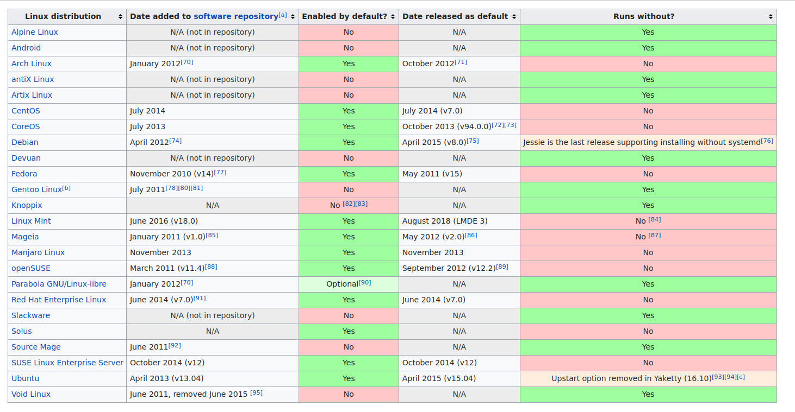

# Systemd


Elk Unix systeem heeft een init systeem. Ons init systeem heeft **PID 1** dat betekend dat dit het allereerste process is dat opstart bij het opstarten van ons systeem. Dit start dan ook meteen nadat de Kernel geboot is. In macOS is dit `launchd`, elke BSD heeft ook een eigen systeem. Ook zijn er verschillende init systemen die je op Linux kan gebuiken als `OpenRC`.

Als we kijken naar de keuzes van Ubuntu hebben we `upstart` sinds 2006 gebruikt en in 2014 vervangen door systemd.
In andere Linux distributies zagen we ook een meer verschijden en vele distro specifieke configuraties terugkomen.

In meeste systemen bestonden services als complexe scripts die veel functionalteiten zelf deden, hierdoor was een eigen service schrijven niet zo handig.

In 2010 in Systemd gestart als idee om init systems beter te maken.
Systemd probeerd complexiteit en overheid van verschillende scripts te verminderen. Het regelt veel zeld op basis van configuratiebestanden.
Ook maakt systemd parallelisatie van het opstartproces mogelijk, oudere initstsemen werkten sequentieel in het uitvoeren van alle opstart scripts. Systemd probeert zoveel mogelijk gelijk te doen.

Systemd kunnen we zien als een allesomvattend init systeem. Het zal niet enkel zorgen voor onze achtergrondproccessen maar ook voor alles omliggend as netwerk instellen tot cron jobs draaien.
Dit lijkt een mooie keuze te zijn maar het is ook de grootste kritiek, het doet namelijk de Unix filosofie teniet. In plaats van vele kleine tooltjes die elks iets heel goed doen te combineren gaat Systemd zelf alles in 1 codebase doen.

Voor ons gaat dit een voordeel bieden dat we veel informatie over onze server in 1 plek gaan kunnen vinden!

### Structuur

De onderstaande structuur komt van Tizen, maar geeft een mooi overzicht van de verschillende componenten van Systemd.


We zien een paar grote groepen:

- `Utilities` dit zijn de tooltjes die wij gaan gebruiken om alles aan te sturen
- `Daemons` zijn achtergrondproccessen van Systemd zelf die alles regelen, deze spreken we aan met onze utilities
- `Targets` zijn delen van het systeem die gestart moeten worden. Wij gaan deze gebruiken in onze services.
- `Core` en `Libraries` zijn de onderliggende basis van Systemd.

### Gebruik

Systemd is terugtevinden in de grote meerderheid van alle Linux distributies, velen hebben rond het jaar 2015 Systemd geadopteerd. Er zijn ook een aantal Linux distributies die specifiek gemaakt zijn voor geen Systemd te hebben zoals `Devuan`. Hieronder is een lijst van grote Linux distribities die Systemd gebruiken volgens Wikipedia:



## Systemd voor Linux Servers

Wat betekend dit nu voor ons? Doorheen de cursus hebben we overal al `systemctl` gebruikt. We bekijken dit nu in meer detail!

We hebben 2 commando's die we veel gaan gebruiken

- `systemctl` dit commando gaat alles van Systemd op onze server uitvoeren.
- `journalctl` dit commando gaat alle logs van Systemd lezen en besturen.

:::warning note
In vele tutorials op het internet ga je het oude `service` commando tegenkomen. Dit commando dateert van voor Systemd maar is zo vaak gebruikt dan Ubuntu een alias instelt dat deze commando's gaat doorsturen naar Systemd.

Gebruik hiervan is afgeraden, Linux distributies die progresiever zijn (zoals Flatcar Linux) hebben deze alias niet (meer).
:::

## Installatie

```bash
# Ik laat deze titel hier om een punt te maken
# Systemd staat al geïnstalleerd
# het heeft je server net opgestart
```

## Gebruik

We gaan verschillende utilities gebruiken in de volgende delen. Maar waar komen deze rare namen als `systemctl` vandaan?
Het is een recente trend in de Linux/Server wereld om een achtergrondprocces te hebben, traditioneel eindigend op `d` van `daemon`.
Kijk naar `httpd` en `sshd`. Deze aansturen doen we via CLI (command line interface) tools die vaak eindigen op `ctl` van `control`. Voorbeelden zijn `bluetoothctl`, `kubectl` en `systemctl`.

### `systemctl`

We gaan `systemctl` gebruiken om alle informatie van Systemd op onze server te lezen.

Eerst gaan we bekijken wat er nu eigenlijk draait in systemd?

```bash
sudo systemctl list-units
```

We krijgen een enorme lijst aan alles wat op ons systeem draait. (Je kan deze verlaren door op `q` te drukken)
We zien niet enkel onze services maar meer units. Een `unit` is een component dat in systemd draait, je herkent het type door hun bestandsextensie. We bekijken er een paar:

- `.device` dit zijn alle aangesloten devices (ook virtueel)
- `.mount` dit zijn alle mountpoints van bestandssystemen
- `.service` dit zijn alle services
- `.socket` dit zijn alle netwerksockets
- `.timer` dit zijn alle timers (vergelijkbaar met Cron jobs)

In ons vak focussen we ons vooral op alle services, we kunnen deze filteren met een simpele `grep`:

```bash
sudo systemctl list-units | grep .service
```

#### Services

Services zijn achtergrondprocessen die wij gaan configureren op onze server. Ze dienen voornamelijk om onze server software te laten draaien.
We hebben al een service op onze Linux server staan, namelijk `nginx`.

Willen we alles weten over de status van NGINX? Dan kunnen we het commando `systemctl status` gebruiken. `nginx.service` is het bestand waar de service zich bevindt.

```bash
sudo systemctl status nginx.service
```

Systemctl gaat ook herkennen dat `nginx` een service is en we kunnen het ook korter schrijven:

```bash
sudo systemctl status nginx
```

`nginx.service` is een file die we meekregen in de installatie van NGINX. We kunnen dit bekijken met `systemctl cat`

```bash
sudo systemctl cat nginx
```

```
$ systemctl cat nginx.service
# /lib/systemd/system/nginx.service
# Stop dance for nginx
# =======================
#
# ExecStop sends SIGSTOP (graceful stop) to the nginx process.
# If, after 5s (--retry QUIT/5) nginx is still running, systemd takes control
# and sends SIGTERM (fast shutdown) to the main process.
# After another 5s (TimeoutStopSec=5), and if nginx is alive, systemd sends
# SIGKILL to all the remaining processes in the process group (KillMode=mixed).
#
# nginx signals reference doc:
# http://nginx.org/en/docs/control.html
#
[Unit]
Description=A high performance web server and a reverse proxy server
Documentation=man:nginx(8)
After=network.target

[Service]
Type=forking
PIDFile=/run/nginx.pid
ExecStartPre=/usr/sbin/nginx -t -q -g 'daemon on; master_process on;'
ExecStart=/usr/sbin/nginx -g 'daemon on; master_process on;'
ExecReload=/usr/sbin/nginx -g 'daemon on; master_process on;' -s reload
ExecStop=-/sbin/start-stop-daemon --quiet --stop --retry QUIT/5 --pidfile /run/nginx.pid
TimeoutStopSec=5
KillMode=mixed

[Install]
WantedBy=multi-user.target
```

Hiermee zien we alle congiguratie opties van de service. We bekijken de deelcomponenten later als we zelf een scrhijven.

We kunnen deze achtergrond service ook stoppen en starten:

```bash
sudo systemctl start nginx.service
sudo systemctl stop nginx.service
```

Of we combineren het met 1 commando:

```bash
sudo systemctl restart nginx.service
```

NGINX ondersteunt ook het "live reloaden" van configuratie, hier kunnen we dit doen:

```bash
sudo systemctl reload nginx.service
```

Hebben we echt problemen met NGINX? Dan hebben we de noodoplossing `kill` dit gaat de service killen in de process list.

```bash
sudo systemctl kill nginx.service # noodrem, do not use
```

We kunnen ook het automatisch opstarten van onze service besturen met Systemd. Met `systemctl enable` kunnen we de service automatisch opstarten bij het opstarten van de server. Met `systemctl disable` kunnen we de service uitschakelen.

```bash
sudo systemctl enable nginx.service
sudo systemctl disable nginx.service
```

#### Eigen service

In de cursus gaan we vaak via onze `apt` installatie al een Systemd service meekrijgen. Echter in de praktijk moeten we vaak eigen services gaan schrijven voor interne applicaties. We gaan hier `simple-service` als voorbeeld gebruiken. Dit is een kleine webserver die ons op poort `8080` een webpagina gaat geven.

Voor we een service kunnen scrhijven hebben we onze binary nodig. Deze kunnen we downloaden van GitHub met `wget` en daarna uitpakken en installeren:

```bash
wget https://github.com/meyskens/simple-service/releases/download/v1.0.0/simple-service_1.0.0_linux_amd64.tar.gz
tar xzf simple-service_1.0.0_linux_amd64.tar.gz
sudo mv simple-service /usr/local/bin/simple-service
```

Meeste configuratie van systemd is te vinden in `/etc/systemd/`, de map `system` hier staan heel wat services. We gaan hier een service schrijven voor onze `simple-service`:

```bash
sudo nano /etc/systemd/system/mijn-service.service
```

Hierin plakken we de volgende configuratie:

```toml
[Unit]
Description=Mijn Coole Server
After=network.target
[Service]
ExecStart=/usr/local/bin/simple-service
Restart=on-failure
RestartSec=10s
[Install]
WantedBy=multi-user.target
```

We zien 3 delen:

- `[Unit]` geeft alle informatie weer over deze Systemd unit.
  - `Description` is een beschrijving van de service
  - `After` geeft weer wat de service moet starten na de `network.target`, dus wanneer de server een netwerk verbinding heeft.
- `[Service]` geeft dat dit een service en verteld ook wat te doen
  - `ExecStart` is het pad naar de binary om uit te voeren
  - `Restart` verteld wanneer Systemd de service moet herstarten. `on-failure` zorgt ervoor dat de service herstart als de binary een fout code geeft.
  - `RestartSec` is de tijd in seconden dat de service moet wachten voor een restart
- `[Install]` geeft alle informatie weer voor de Systemd installatie.
  - `WantedBy` geeft weer wat de service moet worden gestart in de targer `multi-user`, dit draait op alle Linux systemen. Anders start de service niet tenzij een systeem component onze service als dependency heeft.

:::warning note
Er zijn enorm veel opties in Systemd units. We bespreken deze niet allemaal in de cursus. Hieronder zie je een aantal referenties die je kan raadplegen:

- [freedesktop.org manpage over systemd services](https://www.freedesktop.org/software/systemd/man/systemd.service.html)
- [Arch wiki over Systemd](https://wiki.archlinux.org/title/systemd)
- [DigitalOcean over Systemd units](https://www.digitalocean.com/community/tutorials/understanding-systemd-units-and-unit-files)
- [Flatcar documentatie over Advanced Unit Files](https://www.flatcar.org/docs/latest/setup/systemd/getting-started/#advanced-unit-files)

:::

Nu we onze unit file hebben aangemaakt moeten we Systemd vragen deze opnieuw te laden. Dit doen we met:

```bash
sudo systemctl daemon-reload
```

Dit commando moeten we bij elke aanpassing aan een Systemd unit draaien.

Nu we de service hebben aangemaakt kunnen we deze enablen:

```bash
sudo systemctl enable mijn-service.service
```

En we starten de service met:

```bash
sudo systemctl start mijn-service.service
```

Zoals altijd bekijken we ook even de status:

```bash
sudo systemctl status mijn-service.service
```

En ten slotte kijken we ook even naar de output:

```bash
curl http://localhost:8080
```

### `journalctl`

We hebben al eens kort naar logging gekeken eerder in de cursus.
Vandaag vinden we op twee plaatsen logs terug (3 als je systlog nog meeteld) op onze Linux server.

- Applicatie specifieke logfiles, meestal in `/var/log/`
- Journals: deze logfiles zijn geschreven door de `systemd` daemon van het systeem en services.

Applicatie specifieke logging werd vaak gebruikt maar vereist veel werk van de server code zelf. De server (zoals NGINX) is verantwoordelijk voor het schrijven van logging, maar ook voor het verwijderen van oude logfiles. Ook worden oudere logs vaak gecompressed voor schijfruimte te besparen. Meeste van deze files zijn te vinden in `/var/log/`.

In dit hoofdstuk zullen we vooral de Journals bekijken. Deze worden beheerd door de `systemd` daemon. Onze services moeten enkel maar simpele logs sturen naar de [standard output/error](https://en.wikipedia.org/wiki/Standard_streams) en Systemd regeld alles voor ons. Het zal ze opslagen, archiveren en verwijderen wanneer nodig.

#### Bekijken van logs

Logs kunnen we gaam bekijken met `journalctl`.

```bash
sudo journalctl
```

Dit geeft ons ALLE logs van het systeem weer... nu is dat iets te veel om nuttig te zijn.

Met de optie `-u` bekijken we de logs van een specifieke Systemd unit:

```bash
sudo journalctl -u mijn-service
```

We krijgen hier alle logs van onze applicatie zelf maar ook van Systemd over onze service. Probeer deze maar eens te herstarten!

We kunnen ook live onze logs "followen" met `-f`.

```bash
sudo journalctl -u mijn-service -f
```

Deze logs zijn een beetje saai, we stoppen ze met `Ctrl+C`.

We nemen even `ssh` als voorbeeld:

```bash
sudo journalctl -u ssh -f
```

Open nu een 2de termimal en log in op je server, je merkt op dat je de login live kan volgen!

#### Log housekeeping

Logs nemen na een tijdje wel wat ruimte in, zo heeft mijn Linux laptop op dit moment `4GB` aan logfiles, en ik draai nog niet eens een server!

Journalctl kan ons alle informatie geven met:

```bash
sudo journalctl --disk-usage
```

We kunnen dit gaan opruimen met:

```bash
sudo journalctl --vacuum-size=1G
```

Dit commando geeft Journald de opdracht de logs te beperken tot 1GB. Het blijft wel rekening houden met een minimale opslag van log files. Op onze niewe server gaat het weinig uitmaken.

We kunnen ook vragen om oude log files te verwijderen die ouder zijn dan een jaar:

```bash
sudo journalctl --vacuum-time=1years
```

Deze acties zijn manueel uit te voeren, je kan de ook aanpassen in `/etc/systemd/journald.conf`

We hebben verschillende opties:

- `SystemMaxUse=` is de maximale grootte van de systeem logfiles op de schijf
- `SystemMaxFileSize=` is de maximale grootte van 1 logfile op de schijf
- `RuntimeMaxUse=` is de maximale grootte van de runtime logfiles op volitile media (geheugen)
- `RuntimeMaxFileSize=` is de maximale grootte van 1 logfile op volitile media

Voorlopig zijn we nog blij met de standaard waarden!
