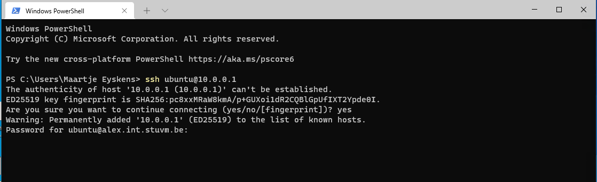

# Remote access via SSH

In praktijk gaan we voor aan een server te werken zelden of nooit fysieke toegang hebben tot onze server. Deze kan zich bevinden in een dataroom verweg in het gebouw of zelfs de andere kant van de wereld. Met dat meeste bedrijven gebruik maken van de cloud is er zelfs weinig bekend waar deze server draait.

Kortom we hebben een veilige manier nodig om onze servers te kunenn configureren en beheren. Uit de lessen netwerken ken je onwaarschijnlijk Telnet en SSH al. In de Linux wereld word er meestal uitsluitend gebruik gemaakt van SSH. SSH heeft vooral zijn populariteit door de goede beveiliging van het protocol. Maar bied ook handige functies aan zoals: versturen van bestanden, doorsturen van netwerkverkeer en meer.

Draai je een server in de cloud dan ga je meestal een SSH login krijgen voor de server verder op te zetten. Dit is ook op onze hosting van onze les VMs het geval.

## Opzetten van SSH

### Installatie

::: warning note
Meeste Linux servers hebben al een SSH server geinstalleerd. Dit is zo het geval voor onze VMs. De volgende instructies zijn ter informatie, of als je op een Ubuntu Desktop SSH wil gebruiken.
:::

We insstalleren onze SSH server via `apt`

```bash
apt install ssh openssh-server # Installeer SSH via apt
systemctl status ssh # check de status van ssh
```

### SSH clients

Nu we een SSH server hebben gaan we ook een SSH client nodig hebben

#### Windows

In het verleden was [PuTTY](https://www.chiark.greenend.org.uk/~sgtatham/putty/download.html) de beste optie voor SSH op Windows.
Sinds recente versies van Windows 10 heeft Microsoft echter ook een SSH client ingebouwd! Je kan deze oproen met het `ssh` commando in PowerShell of CMD.

Echter raden we de nieuwe [Microsoft Terminal](https://www.microsoft.com/en-us/p/windows-terminal/9n0dx20hk701#activetab=pivot:overviewtab) aan. Deze Terminal laat je (na 20 jaar eindelijk) toe de verschillende Windows command line interfaces samen te gebruiken en naar je eigen voorkeuren aan te passen! En is daardoor veel gebruiksvriendelijker dan PowerShell.



#### macOS

macOS heeft een SSH client ingebouwd. Je kan deze gebruiken door gewoon de Terminal app te openen.

#### Linux

Meeste Linux installaties komen standaard met een SSH client. Heb je dit commando niet ter beschikking, dan kun je deze downloaden via je package manager. Onderstaand voorbeeld is voor Ubuntu:

```bash
apt update
apt install ssh
```

### Verbinden met je server

Het SSH commando heeft een simpele opbouw:

```
ssh [options] [user@]hostname
```

Eerst het woord `ssh` gevolgd door eventuele opties, deze gaan we amper gebruiken. Daarna volgt de gebruikersnaam en de hostnaam.

Bijvoorbeeld we willen inloggen met te gebruiker `ubuntu` op de server `10.0.0.1`

```bash
ssh ubuntu@10.0.0.1
```

We proberen dit uit met onze eigen server. We krijgen hierna al meteen een vraag

```
The authenticity of host '10.0.0.1 (10.0.0.1)' can't be established.
ED25519 key fingerprint is SHA256:pc8xxMRaW8kmA/p+GUXoi1dR2CQBlGpUfIXT2Ypde0I.
Are you sure you want to continue connecting (yes/no/[fingerprint])?
```

De eerste keer als je met een server verbind krijg je de vraag of je deze server vertrouwt.
We typen `yes` gevolgd door enter. Dit slaagt de "vingerafdruk" op van onze SSH server's key op. Zo weten we zeker dat de volgende keer wanneer we verbinden met dezelfde server praten!

::: warning note

Stel je herinstalleert je server of je veranderd het IP dan kan je de volgende melding krijgen. Als je zeker weet dat je je server's SSH keys hebt aangepast mag je de remove instructies volgen dat haalt de vingerafdruk weg uit je trust store.

```
@@@@@@@@@@@@@@@@@@@@@@@@@@@@@@@@@@@@@@@@@@@@@@@@@@@@@@@@@@@
@    WARNING: REMOTE HOST IDENTIFICATION HAS CHANGED!     @
@@@@@@@@@@@@@@@@@@@@@@@@@@@@@@@@@@@@@@@@@@@@@@@@@@@@@@@@@@@
IT IS POSSIBLE THAT SOMEONE IS DOING SOMETHING NASTY!
Someone could be eavesdropping on you right now (man-in-the-middle attack)!
It is also possible that a host key has just been changed.
The fingerprint for the ED25519 key sent by the remote host is
SHA256:pc8xxMRaW8kmA/p+GUXoi1dR2CQBlGpUfIXT2Ypde0I.
Please contact your system administrator.
Add correct host key in /home/maartje/.ssh/known_hosts to get rid of this message.
Offending ED25519 key in /home/maartje/.ssh/known_hosts:503
  remove with:
  ssh-keygen -f "/home/maartje/.ssh/known_hosts" -R "10.0.0.1"
ED25519 host key for 10.0.0.1 has changed and you have requested strict checking.
Host key verification failed.
```

:::

Vervolgens gaat je server je wachtwoord vragen:

```
$ ssh ubuntu@10.0.0.1
ubuntu@10.0.0.1's password:
```

Vul dit in. Merk op dat SSH om je veiligheid geeft en zelfs geen sterretjes toont voor het wachtwoord, als je niets ziet is dat dus normaal! Druk dan op enter en je bent nu verbonden met de server! Hierna kan je gewoon werken zoals je gewoon bent op een Linux machine! Je kan ook copy-pasten tussen de machines (handig toch!).

### Security

Secure Shell (SSH) is een cryptografisch netwerk protocol dat gebruikt wordt om netwerkverkeer op te zetten tussen:
verzender;
ontvanger.
Er zijn een tweetal manieren om een autenticatie op een correcte manier te verzorgen bij SSH:
password based authentication;
public key-based authentication.

## The next generation: MOSH
